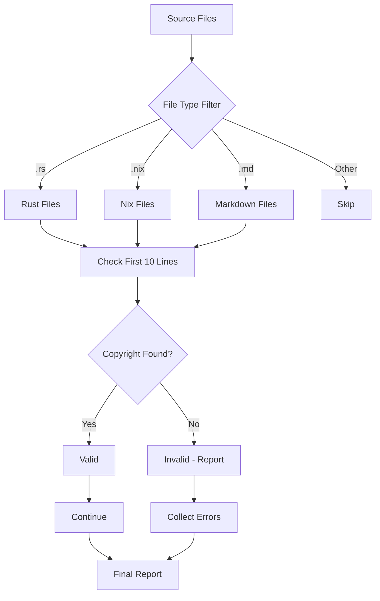

# Copyright Validation Rules

## Purpose
Ensures all source files contain proper copyright attribution to Cowboy AI, LLC.

## Required Copyright Text
```
Copyright (c) 2025 - Cowboy AI, LLC.
```

## File Types and Comment Formats

### Rust Files (.rs)
```rust
// Copyright (c) 2025 - Cowboy AI, LLC.
```

### Nix Files (.nix)
```nix
# Copyright (c) 2025 - Cowboy AI, LLC.
```

### Markdown Files (.md)
```markdown
<!-- Copyright (c) 2025 - Cowboy AI, LLC. -->
```

## Validation Rules

### Location Requirements
- Copyright notice MUST appear within the first 10 lines of the file
- Exact string match required (case-sensitive)
- No variations or modifications allowed

### File Inclusion
- **Check**: .md, .rs, .nix files only
- **Exempt**: target/, result/, *.lock files
- **Exempt**: Generated files, vendor directories

### Validation Behavior
- **Validation Only**: Reports missing copyright notices
- **No Auto-Fix**: Does not automatically add copyright notices
- **Exit Codes**: 0 = all valid, 1 = validation failures found

## Mathematical Proof of Coverage



## Implementation Requirements

### Algorithm Complexity
- **Time Complexity**: O(n*k) where n = file count, k = lines to check (≤10)
- **Space Complexity**: O(m) where m = number of invalid files
- **Optimal for CI/CD**: Fast validation with minimal resource usage

### Error Reporting Format
```
Copyright validation failed:
  - path/to/file.rs: Missing copyright notice
  - path/to/other.nix: Missing copyright notice
  
Total files checked: 42
Files missing copyright: 2
```

### Exit Behavior
- Success (all valid): Exit code 0, minimal output
- Failure (missing copyright): Exit code 1, detailed report
- Error (filesystem issues): Exit code 2, error details

## Integration Points

### Nix Flake Integration
- Defined as `packages.copyright-validator`
- Available via `nix run .#copyright-validator`
- Integrated into `nix flake check` if desired

### Pre-commit Hook Potential
- Can be used as pre-commit validation
- Prevents commits with missing copyright
- Fast execution suitable for git hooks