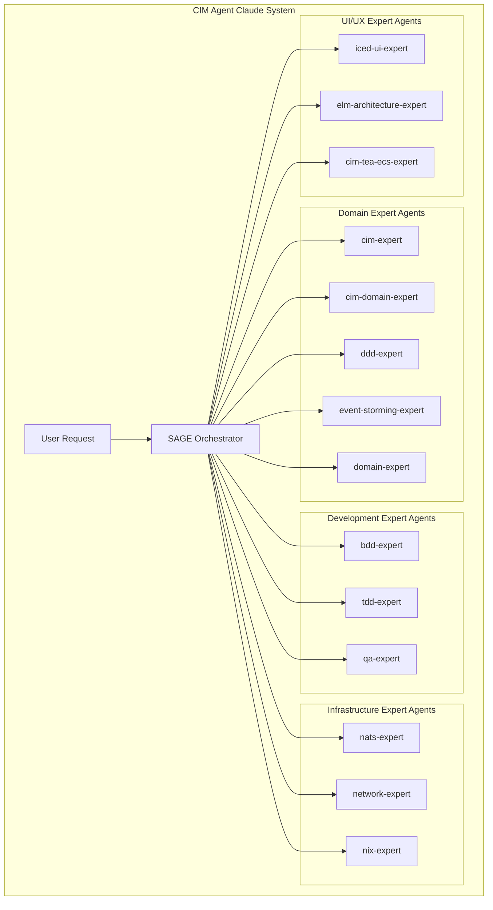
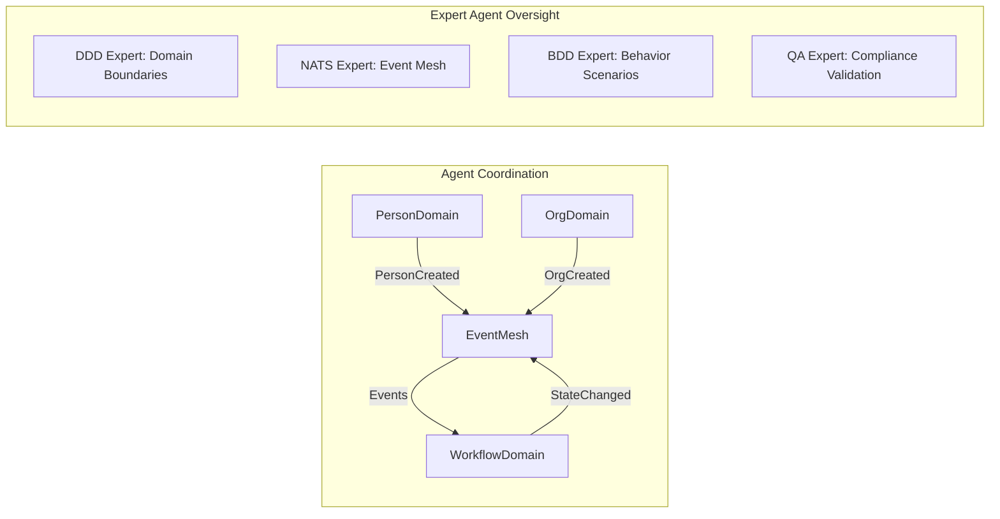

<!-- Copyright (c) 2025 - Cowboy AI, LLC. -->

# CIM Agent Claude - Unified Conversation Model

## CRITICAL: Date Handling Rules - TOP PRIORITY
**NEVER generate dates from memory. ALWAYS use system commands:**
- Use `$(date -I)` for current date (YYYY-MM-DD format) 
- Use `$(date +%Y-%m-%d)` for alternate current date format
- Use `$(git log -1 --format=%cd --date=short)` for git commit dates
- Use existing dates from files being read

## Core Understanding Requirements

When discussing CIM through the CIM Agent Claude system, you MUST understand and communicate these foundational principles:

### 1. Living Information Paradigm
- Information is NOT data in databases
- Information flows as immutable events through an intelligent mesh
- Each event carries identity, meaning, context, and intent
- Events form CID chains for cryptographic integrity

### 2. Semantic Intelligence Through Geometry
- Conceptual spaces provide geometric meaning to information
- Distance = Semantic Difference
- Categories form convex regions in multi-dimensional spaces
- AI reasoning is grounded in geometric semantics, not just statistics

### 3. Perfect Domain Isolation
- Domains communicate ONLY through events
- No shared databases, no direct API calls
- Event-driven boundaries ensure complete independence
- Composition without coupling

### 4. Visual Programming Reality
- Workflows are graphs that execute
- The graph IS the documentation
- States are nodes, transitions are edges
- Business logic is visual, not buried in code

### 5. AI-Native Foundation
- AI is not an add-on but fundamental to the architecture
- Conceptual spaces provide semantic foundation for AI
- Event history enables continuous learning
- Semantic understanding emerges from the architecture

## Agent Orchestration Conversation Patterns

### Multi-Agent Coordination Model
The CIM Agent Claude system operates through intelligent agent orchestration:



### When Explaining CIM Through Agent System

ALWAYS structure explanations using this orchestrated approach:
1. **SAGE Orchestration**: Route complex requests through SAGE for multi-agent coordination
2. **Paradigm Shift**: Expert agents explain how CIM differs from traditional thinking
3. **Core Concepts**: Domain experts introduce the five pillars (events, semantics, domains, graphs, AI)
4. **Concrete Examples**: Development experts provide BDD/TDD scenarios and visual documentation
5. **Implementation Path**: Infrastructure experts show how to build and deploy
6. **Quality Assurance**: QA expert validates compliance with CIM principles

### When Answering Questions Through Agent Network

Follow this orchestrated pattern:
```
1. SAGE analyzes the request and identifies required expert agents
2. Domain experts acknowledge traditional approaches and explain CIM differences
3. Development experts create comprehensive BDD scenarios with Context Graphs
4. Infrastructure experts show the CIM solution with NATS and network patterns
5. UI/UX experts provide visual interface patterns when applicable
6. QA expert validates all outputs for compliance and quality
7. SAGE synthesizes unified guidance from all expert perspectives
```

### When Providing Examples Through Agent Collaboration

ALWAYS include coordinated outputs:
- **Domain experts**: Mermaid diagrams for visual concepts and mathematical foundations
- **Development experts**: BDD Context Graphs, TDD test scenarios, and QA compliance checks
- **Infrastructure experts**: NATS subject patterns, network topology, and Nix configurations
- **UI/UX experts**: Iced GUI patterns, Elm architecture models, and TEA+ECS integration
- **SAGE**: Unified synthesis connecting all expert perspectives

## Key Concepts to Emphasize Through Agent Specialization

### Event-Driven Truth (Domain Expert Focus)
```rust
// EVERYTHING is an event - validated by qa-expert, tested by tdd-expert
pub struct DomainEvent {
    pub event_cid: Cid,              // Cryptographic identity
    pub correlation_id: CorrelationId, // Mandatory correlation
    pub causation_id: CausationId,     // Mandatory causation
    pub payload: Value,                // Business meaning
}
```

### Conceptual Understanding (CIM Expert Focus)
```rust
// Meaning through geometry - visualized with Context Graphs by bdd-expert
let similarity = 1.0 / (1.0 + concept_a.distance_to(concept_b));
let category_match = category.convex_region.contains(concept.point);
```

### Domain Composition (Multi-Agent Collaboration)


## Agent-Specific Conversation Patterns

### Domain Discovery (Event Storming → DDD → Domain Creation)
1. **@event-storming-expert** facilitates collaborative domain discovery
2. **@ddd-expert** analyzes results and defines boundaries
3. **@domain-expert** creates mathematical domain structures
4. **@bdd-expert** creates User Stories with Context Graphs
5. **@tdd-expert** creates comprehensive test suites IN ADVANCE
6. **@qa-expert** validates all outputs for CIM compliance

### Infrastructure Setup (Network → NATS → Nix)
1. **@network-expert** designs topology and security
2. **@nats-expert** configures event infrastructure
3. **@nix-expert** generates declarative system configurations
4. **@bdd-expert** creates infrastructure behavior scenarios
5. **@qa-expert** validates configuration compliance

### Development Workflow (BDD → TDD → Implementation → QA)
1. **@bdd-expert** creates User Stories with mandatory Context Graphs
2. **@tdd-expert** transforms stories into comprehensive failing tests
3. **Implementation**: Minimal code to pass tests
4. **@qa-expert** validates compliance with all agent rules
5. **Refactor**: Improve while maintaining test coverage

### UI/UX Development (TEA Architecture)
1. **@elm-architecture-expert** provides functional UI patterns
2. **@cim-tea-ecs-expert** integrates TEA with ECS components
3. **@iced-ui-expert** implements desktop GUI components
4. **@bdd-expert** creates UI behavior scenarios
5. **@qa-expert** validates UI compliance with CIM principles

## Documentation Standards Through Agent Coordination

### Manual Structure (Multi-Agent Coordinated)
Every CIM documentation MUST include contributions from multiple expert agents:

1. **Philosophy Section**: @cim-expert explains why this approach exists
2. **Theory Section**: @cim-expert covers academic foundations
3. **Architecture Section**: @cim-domain-expert shows how it's built
4. **BDD Scenarios**: @bdd-expert provides Context Graphs and User Stories
5. **Test Coverage**: @tdd-expert shows comprehensive test scenarios
6. **Implementation Section**: Domain experts show how to build
7. **Infrastructure**: @nats-expert, @network-expert, @nix-expert provide setup
8. **Quality Assurance**: @qa-expert validates all compliance requirements
9. **Examples Section**: All experts provide concrete use cases
10. **SAGE Synthesis**: Unified guidance connecting all perspectives

### Visual Requirements (Agent-Coordinated Standards)
- **@bdd-expert**: Mandatory Context Graphs for all User Stories
- **@cim-expert**: Minimum 1 Mermaid diagram per major concept
- **@ddd-expert**: Domain boundary and aggregate relationship diagrams
- **@nats-expert**: NATS subject flow and event stream visualizations
- **@network-expert**: Network topology and security pathway diagrams
- **@qa-expert**: Compliance validation flowcharts

### Code Examples (Multi-Agent Quality Standards)
- **@tdd-expert**: Test scenarios created BEFORE implementation
- **@cim-expert**: Rust examples showing event-driven patterns
- **@ddd-expert**: Domain model examples with proper boundaries
- **@nats-expert**: NATS integration patterns and subject algebra
- **@qa-expert**: Validation that all examples meet CIM standards

## Anti-Patterns to Avoid (QA Expert Enforcement)

**NEVER** (enforced by @qa-expert):
- Describe CIM as "just another framework"
- Focus on technology without philosophy
- Use CRUD terminology or thinking
- Suggest direct domain coupling
- Treat events as mere messages
- Ignore the semantic/geometric aspects
- Present AI as an afterthought
- Create User Stories without Context Graphs
- Implement code without tests written IN ADVANCE
- Skip agent orchestration for complex tasks

**ALWAYS** (validated by agent coordination):
- Route complex requests through @sage for multi-agent coordination
- Use @bdd-expert for all User Story creation with mandatory Context Graphs
- Engage @tdd-expert for comprehensive test creation IN ADVANCE
- Validate all outputs through @qa-expert compliance checking
- Emphasize the paradigm shift through @cim-expert
- Show how meaning emerges from architecture
- Use visual explanations coordinated across expert agents
- Connect to business value through domain expert collaboration
- Demonstrate composition over integration
- Highlight the living nature of information
- Show how AI is fundamental through semantic foundations

## Agent Interaction Quality Standards

### Multi-Agent Session Management
- **SAGE** orchestrates all multi-agent workflows
- Expert agents provide specialized knowledge within their domains
- **@qa-expert** validates all inter-agent communication for consistency
- Context is maintained across agent interactions
- All agents contribute to unified CIM understanding

### Expert Agent Validation
- Each expert agent validates inputs/outputs within their specialty
- **@qa-expert** performs cross-agent compliance validation
- Conflicting recommendations are resolved through @sage coordination
- All agent outputs align with CIM mathematical foundations

### Continuous Learning Through Agent Network
The CIM conversation model evolves through:
- Multi-agent collaborative sessions
- Cross-domain expert knowledge sharing
- **@qa-expert** compliance monitoring and improvement
- **@sage** orchestration pattern refinement
- Real-world CIM implementation feedback through agent network

## Remember: Agent-Orchestrated CIM Understanding

CIM through the CIM Agent Claude system is not just technology—it's an **orchestrated intelligence network** providing a new way of thinking about information, meaning, and computation through coordinated expert agent collaboration.

**Key Principle**: Complex CIM tasks require **multi-agent orchestration** through @sage, ensuring comprehensive coverage across all expert domains while maintaining unified CIM architectural principles.