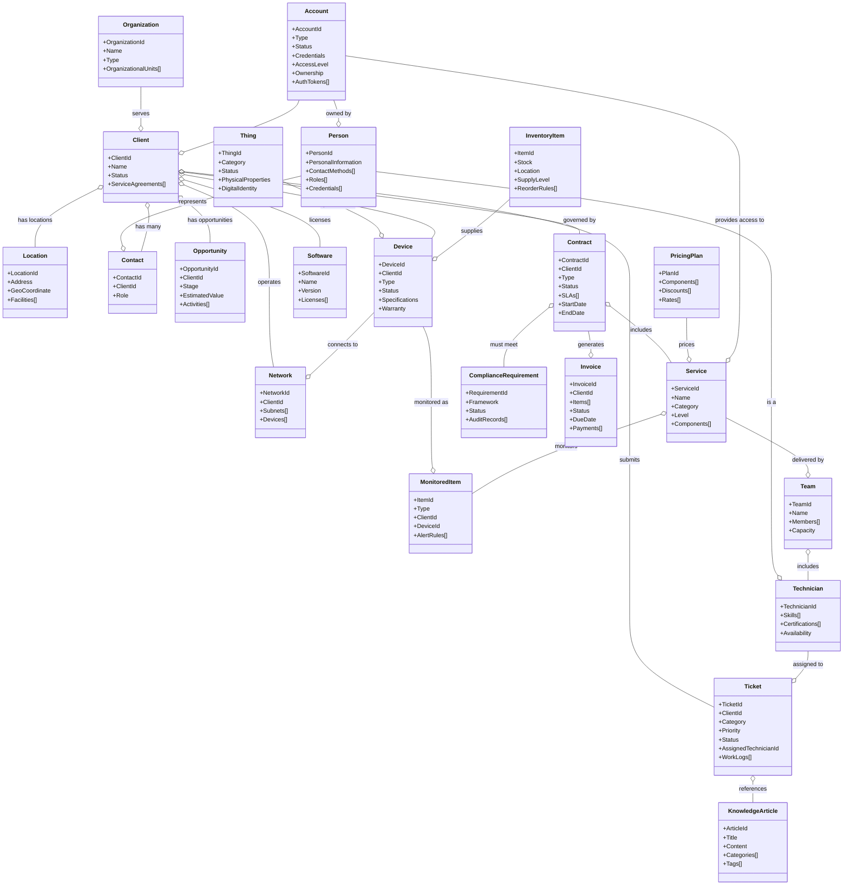
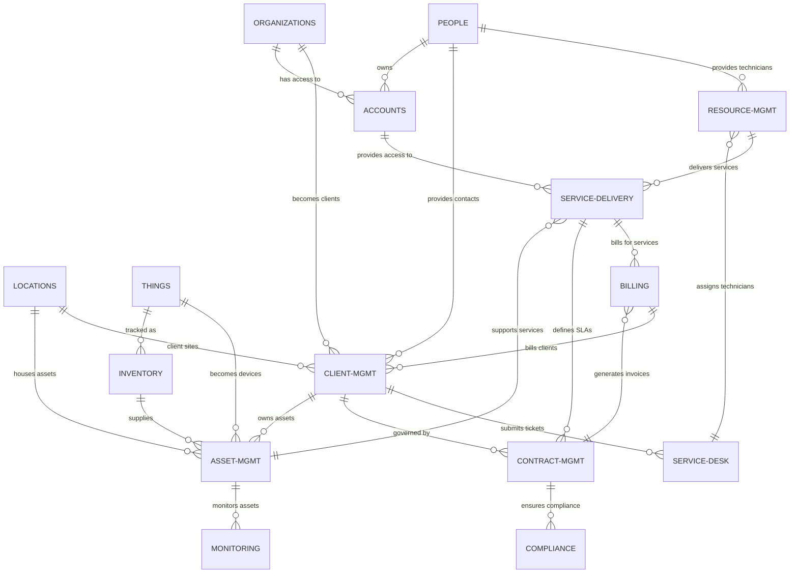

# Cowboy AI Domain Model Diagram

```mermaid
classDiagram
    %% Foundational Aggregates
    class Person {
        +PersonId
        +PersonalInformation
        +ContactMethods[]
        +Roles[]
        +Credentials[]
    }
    
    class Organization {
        +OrganizationId
        +Name
        +Type
        +OrganizationalUnits[]
    }
    
    class Location {
        +LocationId
        +Address
        +GeoCoordinate
        +Facilities[]
    }
    
    class Thing {
        +ThingId
        +Category
        +Status
        +PhysicalProperties
        +DigitalIdentity
    }
    
    class InventoryItem {
        +ItemId
        +Stock
        +Location
        +SupplyLevel
        +ReorderRules[]
    }
    
    class Account {
        +AccountId
        +Type
        +Status
        +Credentials
        +AccessLevel
        +Ownership
        +AuthTokens[]
    }

    %% Client Management Context
    class Client {
        +ClientId
        +Name
        +Status
        +ServiceAgreements[]
    }
    
    class Contact {
        +ContactId
        +ClientId
        +Role
    }
    
    class Opportunity {
        +OpportunityId
        +ClientId
        +Stage
        +EstimatedValue
        +Activities[]
    }

    %% Service Desk Context
    class Ticket {
        +TicketId
        +ClientId
        +Category
        +Priority
        +Status
        +AssignedTechnicianId
        +WorkLogs[]
    }
    
    class KnowledgeArticle {
        +ArticleId
        +Title
        +Content
        +Categories[]
        +Tags[]
    }

    %% Asset Management Context
    class Device {
        +DeviceId
        +ClientId
        +Type
        +Status
        +Specifications
        +Warranty
    }
    
    class Software {
        +SoftwareId
        +Name
        +Version
        +Licenses[]
    }
    
    class Network {
        +NetworkId
        +ClientId
        +Subnets[]
        +Devices[]
    }

    %% Service Delivery Context
    class Service {
        +ServiceId
        +Name
        +Category
        +Level
        +Components[]
    }
    
    class MonitoredItem {
        +ItemId
        +Type
        +ClientId
        +DeviceId
        +AlertRules[]
    }

    %% Resource Management Context
    class Technician {
        +TechnicianId
        +Skills[]
        +Certifications[]
        +Availability
    }
    
    class Team {
        +TeamId
        +Name
        +Members[]
        +Capacity
    }

    %% Contract Management Context
    class Contract {
        +ContractId
        +ClientId
        +Type
        +Status
        +SLAs[]
        +StartDate
        +EndDate
    }
    
    class ComplianceRequirement {
        +RequirementId
        +Framework
        +Status
        +AuditRecords[]
    }

    %% Billing Context
    class Invoice {
        +InvoiceId
        +ClientId
        +Items[]
        +Status
        +DueDate
        +Payments[]
    }
    
    class PricingPlan {
        +PlanId
        +Components[]
        +Discounts[]
        +Rates[]
    }

    %% Core Domain Relationships
    Organization --o Client : serves
    Person --o Contact : represents
    Person --o Technician : is a
    Thing --o Device : specializes to
    Account --o Client : provides access to
    
    %% Client Management Relationships
    Client o-- Contact : has many
    Client o-- Location : has locations
    Client o-- Opportunity : has opportunities
    Client o-- Contract : governed by
    
    %% Service Desk Relationships
    Client o-- Ticket : submits
    Ticket o-- KnowledgeArticle : references
    Technician --o Ticket : assigned to
    Team o-- Technician : includes
    
    %% Asset Management Relationships
    Client o-- Device : owns
    Client o-- Software : licenses
    Client o-- Network : operates
    Device --o Network : connects to
    Device --o MonitoredItem : monitored as
    
    %% Contract & Billing Relationships
    Contract o-- Service : includes
    Contract --o Invoice : generates
    Contract o-- ComplianceRequirement : must meet
    PricingPlan --o Service : prices
    
    %% Inventory & Asset Relationships
    InventoryItem --o Device : supplies
    
    %% Service Delivery Relationships
    Service o-- MonitoredItem : monitors
    Service --o Team : delivered by
    
    %% Account Relationships
    Account --o Service : provides access to
    Account --o Person : owned by
```

## Domain Event Flow Diagram

```mermaid
flowchart TD
    %% Foundational Event Flows
    PE[People Events] --> RM[Resource Management]
    PE --> CM[Client Management]
    
    OE[Organization Events] --> CM
    OE --> CoM[Contract Management]
    
    LE[Location Events] --> CM
    LE --> SD[Service Delivery]
    
    TE[Thing Events] --> AM[Asset Management]
    TE --> INV[Inventory]
    
    IE[Inventory Events] --> AM
    IE --> SD
    
    AE[Account Events] --> SD
    AE --> SEC[Security]
    
    %% Client Management Event Flows
    CM_E[Client Management Events] --> CoM
    CM_E --> BIL[Billing]
    CM_E --> RM
    
    %% Service Desk Event Flows
    SD_E[Service Desk Events] --> RM
    SD_E --> SD
    SD_E --> CM
    SD_E --> BIL
    
    %% Asset Management Event Flows
    AM_E[Asset Management Events] --> SD
    AM_E --> MON[Monitoring]
    AM_E --> INV
    AM_E --> CM
    
    %% Service Delivery Event Flows
    SD_DE[Service Delivery Events] --> CM
    SD_DE --> BIL
    SD_DE --> CoM
    
    %% Resource Management Event Flows
    RM_E[Resource Management Events] --> SD
    RM_E --> SDESK[Service Desk]
    
    %% Contract Management Event Flows
    CoM_E[Contract Management Events] --> BIL
    CoM_E --> CM
    CoM_E --> SD
    
    %% Billing Event Flows
    BIL_E[Billing Events] --> CM
    BIL_E --> CoM
    
    %% Integration Event Flows
    INT_E[Integration Events] --> SD
    INT_E --> MON
    INT_E --> SDESK
    
    %% Legend
    subgraph Legend
        F[Foundational Context]
        B[Bounded Context]
        E[Events]
    end
    
    %% Foundational Contexts
    subgraph Foundational Contexts
        PE
        OE
        LE
        TE
        IE
        AE
    end
    
    %% Business Contexts
    subgraph Business Contexts
        CM
        SDESK
        AM
        SD
        RM
        CoM
        BIL
        MON
        SEC
        INV
    end
    
    %% Event Sources
    subgraph Event Sources
        CM_E
        SD_E
        AM_E
        SD_DE
        RM_E
        CoM_E
        BIL_E
        INT_E
    end
```

## Aggregate Relationships Diagram

```mermaid
erDiagram
    PEOPLE ||--o{ RESOURCE-MGMT : "provides technicians"
    PEOPLE ||--o{ CLIENT-MGMT : "provides contacts"
    PEOPLE ||--o{ ACCOUNTS : "owns"
    
    ORGANIZATIONS ||--o{ CLIENT-MGMT : "becomes clients"
    ORGANIZATIONS ||--o{ ACCOUNTS : "has access to"
    
    LOCATIONS ||--o{ CLIENT-MGMT : "client sites"
    LOCATIONS ||--o{ ASSET-MGMT : "houses assets"
    
    THINGS ||--o{ ASSET-MGMT : "becomes devices"
    THINGS ||--o{ INVENTORY : "tracked as"
    
    INVENTORY ||--o{ ASSET-MGMT : "supplies"
    
    ACCOUNTS ||--o{ SERVICE-DELIVERY : "provides access to"
    
    CLIENT-MGMT ||--o{ SERVICE-DESK : "submits tickets"
    CLIENT-MGMT ||--o{ CONTRACT-MGMT : "governed by"
    CLIENT-MGMT ||--o{ ASSET-MGMT : "owns assets"
    
    SERVICE-DESK ||--o{ RESOURCE-MGMT : "assigns technicians"
    
    ASSET-MGMT ||--o{ SERVICE-DELIVERY : "supports services"
    ASSET-MGMT ||--o{ MONITORING : "monitors assets"
    
    SERVICE-DELIVERY ||--o{ BILLING : "bills for services"
    SERVICE-DELIVERY ||--o{ CONTRACT-MGMT : "defines SLAs"
    
    RESOURCE-MGMT ||--o{ SERVICE-DELIVERY : "delivers services"
    
    CONTRACT-MGMT ||--o{ BILLING : "generates invoices"
    CONTRACT-MGMT ||--o{ COMPLIANCE : "ensures compliance"
    
    BILLING ||--o{ CLIENT-MGMT : "bills clients"
``` 