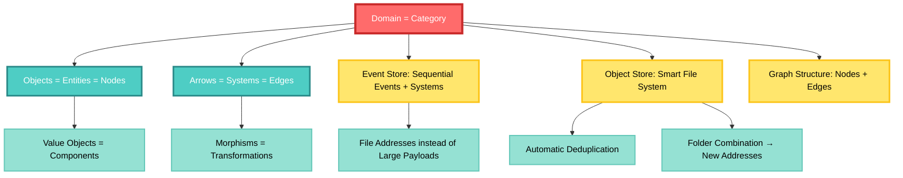
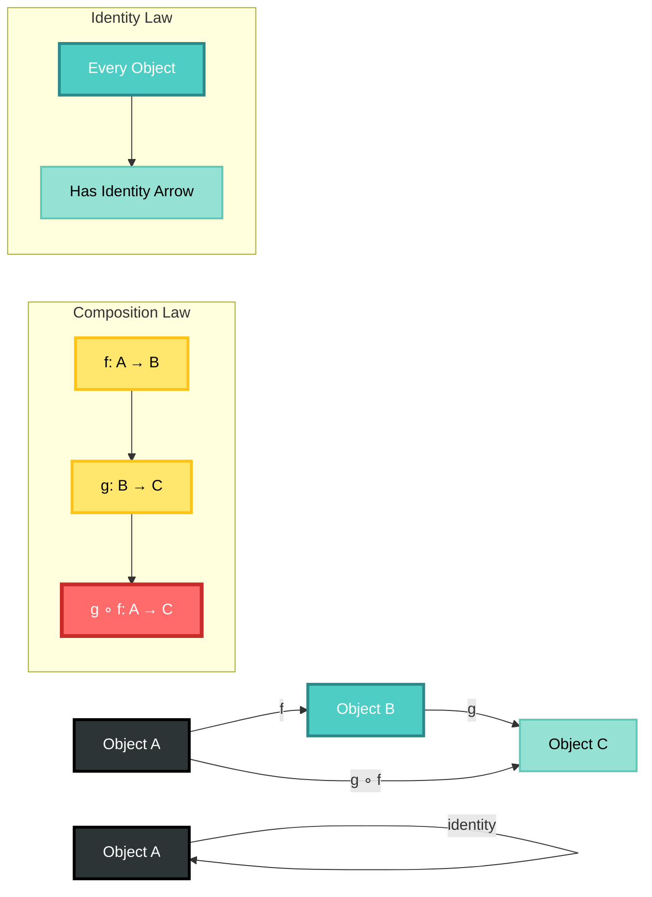
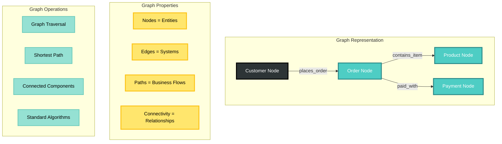
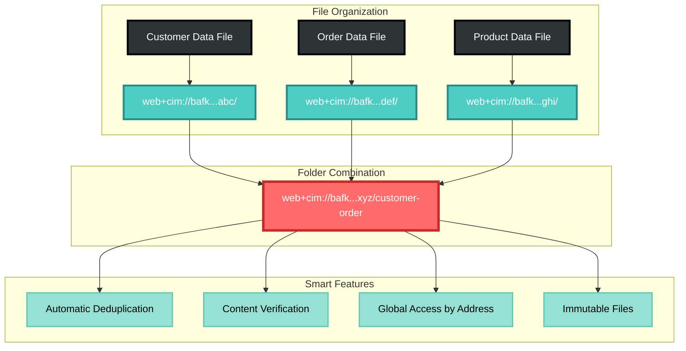
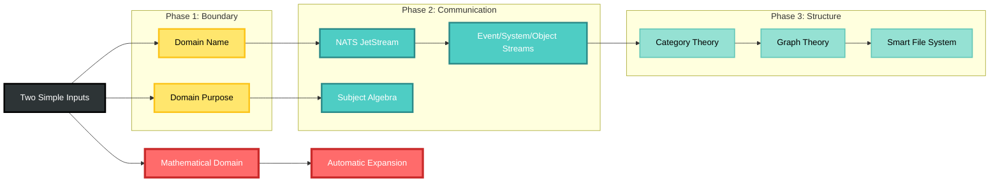

# Mathematical Domain Creation in CIM-Start

**Copyright 2025 - Cowboy AI, LLC**

## Introduction: Simplifying Domain Creation Through Mathematical Constructs

CIM-Start revolutionizes domain creation by leveraging fundamental mathematical structures that naturally preserve their properties as they propagate through distributed systems. By grounding domain creation in **Category Theory**, **Graph Theory**, and **Content-Addressed Storage**, we achieve remarkable simplification while maintaining mathematical rigor.

## The Mathematical Foundation

### Why Mathematical Constructs Simplify Domain Creation

Traditional domain modeling requires complex abstractions, numerous design patterns, and intricate relationships that often break down in distributed systems. CIM-Start eliminates this complexity by using mathematical structures that are:

1. **Inherently Consistent**: Mathematical structures have well-defined properties that remain invariant
2. **Naturally Composable**: Mathematical objects combine predictably without breaking
3. **Structure-Preserving**: Properties are maintained as objects move through the system
4. **Self-Describing**: The mathematics provides the specification

## The Three-Foundation Architecture



### 1. Category Theory: The Conceptual Foundation

**Domain = Category**
- Every Domain is a mathematical Category containing Objects and Arrows
- **Objects = Entities** (business objects, data structures)
- **Arrows = Systems** (transformations, processes, morphisms)
- **Composition**: Arrows compose mathematically, ensuring system consistency

**Why This Simplifies Domain Creation:**
```yaml
# Instead of complex domain modeling, you define:
domain:
  name: "customer-service"           # Category identifier
  purpose: "Handle customer interactions"  # Category scope

# The mathematics handles the rest:
# - Objects (Entities) automatically get proper structure
# - Arrows (Systems) automatically compose correctly
# - Morphisms ensure transformations are valid
# - Functors enable communication between domains
```

**Category Theory Composition Laws:**



### 2. Graph Theory: The Data Structure

**Objects = Nodes, Arrows = Edges**
- Every Entity becomes a Node in a graph
- Every System becomes an Edge connecting Nodes
- **Relationships are explicit** and mathematically defined
- **Traversal is natural** through graph algorithms

**Why This Simplifies Domain Creation:**
- No complex relationship mapping required
- Graph algorithms provide standard operations
- Visualization is inherent
- Distribution follows graph partitioning principles

**Graph Theory Structure:**



### 3. Content-Addressed Storage (IPLD): The Persistence Layer

**Immutable, Deduplicatable Objects**
- Every piece of data gets a **Content-Addressed ID (CID)**
- Identical content = identical CID = automatic deduplication
- **Structure-preserving** across network boundaries
- **Self-validating** through cryptographic hashing

**Why This Simplifies Domain Creation:**
```yaml
# Instead of complex data modeling:
large_payload: 
  address: "web+cim://bafk...abc123/customer-database"
  type: "CustomerDatabase"
  
# The system automatically:
# - Deduplicates identical data
# - Distributes efficiently
# - Validates integrity
# - Enables global referencing
```

**Smart File System Structure:**



## Domain Creation Process: Mathematical Simplicity



### Phase 1: Establish Category (Domain Boundary)

**Input Required:**
```yaml
Name: "unique-domain-identifier"      # Category name
Purpose: "clear-reasoning-context"    # Category scope
```

**Mathematical Result:**
- **Category C** is created with name and purpose
- **Object set** Ob(C) is established (initially empty)
- **Arrow set** Ar(C) is established (initially empty)
- **Composition rules** are inherited from Category Theory

### Phase 2: Create Communication Mechanism

**Automatic Generation:**
```yaml
# NATS Subject Algebra (automatically generated):
{domain}.nodes.{entity}.{event}.{id}      # Node operations
{domain}.edges.{system}.{action}          # Edge operations  
{domain}.objects.{cid}.{operation}        # Object Store operations
{domain}.graph.{network}.{operation}      # Graph operations
{domain}.functors.{mapping}.{event}       # Category functors

# NATS Streams (automatically created):
DOMAIN_{DOMAIN_NAME}_EVENTS     # Event Store with CID references
DOMAIN_{DOMAIN_NAME}_SYSTEMS    # System Store with CID references  
DOMAIN_{DOMAIN_NAME}_OBJECTS    # IPLD Object Store
```

### Phase 3: Enable Structure-Preserving Communication

**Automatic Configuration:**
- **Claude Hooks**: Function as Category functors
- **IPLD Integration**: Content-addressed object management
- **Graph Traversal**: Built-in relationship navigation
- **Event Sourcing**: Temporal consistency through mathematics

## Structure-Preserving Properties

### 1. Category Theory Preservation

**Composition Laws:**
- If f: A → B and g: B → C, then g ∘ f: A → C
- **Identity**: Every object has an identity morphism
- **Associativity**: (h ∘ g) ∘ f = h ∘ (g ∘ f)

**System Implication:**
```yaml
# Systems compose naturally:
CustomerCreated → EmailSent → NotificationLogged
# This composition is mathematically guaranteed to be valid
```

### 2. Graph Theory Preservation

**Structural Invariants:**
- **Node connectivity** is preserved across distribution
- **Path properties** remain consistent
- **Graph algorithms** work uniformly across the system

**System Implication:**
```yaml
# Relationships are mathematically guaranteed:
customer_node --[places_order]--> order_node --[contains_items]--> item_nodes
# This structure is preserved in distributed storage and retrieval
```

### 3. Content-Addressed Preservation

**Cryptographic Guarantees:**
- **Immutability**: CID = hash(content), tampering is detectable
- **Deduplication**: Identical content = identical CID
- **Referential Integrity**: CID always points to correct content

**System Implication:**
```yaml
# Data integrity is mathematically guaranteed:
event:
  id: "order-created-001"
  payload_cid: "bafybeigdyrzt5sfp7udm7hu76uh7y26nf3efuylqabf3oclgtqy55fbzdi"
  
# The CID cryptographically guarantees the payload content
# Deduplication happens automatically
# Distribution is content-verified
```

## Propagation Through the System

### How Mathematical Structures Propagate

#### 1. Category Functors Enable Domain Communication
```yaml
# When Domain A needs to communicate with Domain B:
functor_AB: Category_A → Category_B

# This functor:
# - Maps objects to objects (Entities to Entities)
# - Maps arrows to arrows (Systems to Systems)  
# - Preserves composition (System chains remain valid)
# - Preserves identity (Entity identity is maintained)
```

#### 2. Graph Morphisms Preserve Relationships
```yaml
# When graph data moves between systems:
graph_morphism: Graph_A → Graph_B

# This morphism:
# - Maps nodes to nodes (preserving entity structure)
# - Maps edges to edges (preserving system relationships)
# - Preserves adjacency (connected things stay connected)
# - Maintains path properties (reachability is preserved)
```

#### 3. IPLD Links Maintain Content Integrity
```yaml
# When objects move through the network:
ipld_link: CID → Content

# This link:
# - Cryptographically verifies content
# - Enables deduplication across boundaries
# - Provides location-independent addressing
# - Maintains referential integrity
```

## Practical Benefits of Mathematical Simplification

### 1. Minimal Configuration Required

**Traditional Domain Setup:**
- Define entities, relationships, constraints
- Configure databases, schemas, migrations
- Set up event schemas, CQRS patterns via separate modules
- Design APIs, serialization formats
- Implement caching, deduplication logic
- Create monitoring, logging systems

**CIM Mathematical Approach:**
```yaml
# Single configuration file:
domain:
  name: "customer-service"
  purpose: "Handle customer interactions"

# Everything else is mathematically derived:
# - Graph structure is automatic
# - Event-driven patterns follow from Category Theory via cim-domain
# - IPLD provides storage and deduplication
# - NATS provides communication patterns
# - Monitoring follows from mathematical properties
```

### 2. Guaranteed Consistency

**Mathematical Properties Ensure:**
- **Compositional Safety**: System combinations always work
- **Referential Integrity**: Content-addressed links never break
- **Structural Preservation**: Relationships are maintained across distribution
- **Identity Laws**: Objects maintain their identity throughout the system

### 3. Natural Scalability

**Graph Partitioning:**
- Domains naturally partition along Category boundaries
- Graph algorithms optimize data placement
- Content addressing enables global deduplication

**Mathematical Scaling:**
```yaml
# Scaling is mathematically predictable:
nodes_per_domain: O(entities)
edges_per_domain: O(relationships)
communication_overhead: O(functor_mappings)
storage_efficiency: O(unique_content_via_CID)
```

## Implementation Example

### Creating a Customer Service Domain

**Step 1: Mathematical Definition**
```yaml
domain:
  name: "customer-service"
  purpose: "Manage customer support interactions and resolution workflows"
```

**Step 2: Automatic Mathematical Expansion**

The system automatically generates:

```yaml
# Category Theory Structure:
category_customer_service:
  objects:  # Will contain customer entities, ticket entities, etc.
    - type: "Entity/Node"
    - composition_rules: "Category Theory"
  
  arrows:   # Will contain support systems, escalation systems, etc.
    - type: "System/Edge"  
    - composition_rules: "Category Theory"

# Graph Theory Structure:
graph_customer_service:
  nodes: []     # Entities as graph nodes
  edges: []     # Systems as graph edges
  algorithms:   # Built-in graph traversal, search, optimization
    - "shortest_path"
    - "connected_components"
    - "graph_traversal"

# IPLD Object Store:
object_store_customer_service:
  storage_type: "IPLD"
  transport: "NATS JetStream"
  deduplication: "automatic_via_CID"
  
# NATS Communication:
nats_streams:
  - "DOMAIN_CUSTOMER_SERVICE_EVENTS"    # Event store with CID refs
  - "DOMAIN_CUSTOMER_SERVICE_SYSTEMS"   # System store with CID refs
  - "DOMAIN_CUSTOMER_SERVICE_OBJECTS"   # IPLD object store

# Subject Algebra:
subjects:
  - "customer-service.nodes.customer.{event}.{id}"
  - "customer-service.edges.support-system.{action}"
  - "customer-service.objects.{cid}.{operation}"
```

**Step 3: Structure-Preserving Usage**

```yaml
# Adding entities (automatic graph node creation):
customer_entity:
  type: "Node"
  category: "customer-service"
  payload_cid: "bafybeigdyrzt5sfp7udm7hu76uh7y26nf3efuylqabf3oclgtqy55fbzdi"

# Adding systems (automatic graph edge creation):
escalation_system:
  type: "Edge"
  source_node: "support_ticket"
  target_node: "manager_queue"
  morphism: "escalate_to_manager"

# The mathematics ensures:
# - Proper composition (systems chain correctly)
# - Referential integrity (CIDs are valid)
# - Graph consistency (nodes and edges are properly connected)
# - Communication patterns (NATS subjects are correct)
```

## Conclusion: Mathematical Elegance in Practice

By grounding domain creation in fundamental mathematical structures, CIM-Start achieves:

1. **Dramatic Simplification**: Two parameters (Name, Purpose) expand into a complete domain
2. **Automatic Consistency**: Mathematical properties guarantee system correctness
3. **Natural Scalability**: Graph partitioning and content addressing handle distribution
4. **Structure Preservation**: Mathematical constructs maintain their properties across the entire system
5. **Self-Describing Systems**: The mathematics provides the specification and implementation

The result is domain creation that feels almost magical in its simplicity, yet is grounded in rigorous mathematical foundations that ensure reliability, scalability, and maintainability at enterprise scale.

**The mathematical constructs don't just model the domain—they *are* the domain**, propagating through the system with their properties intact, enabling true composability and effortless distributed operation.