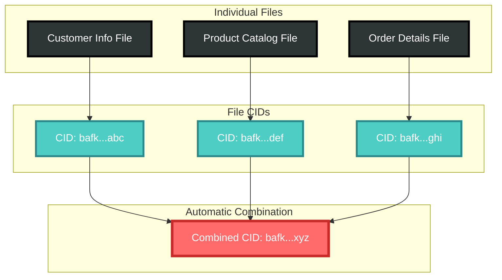
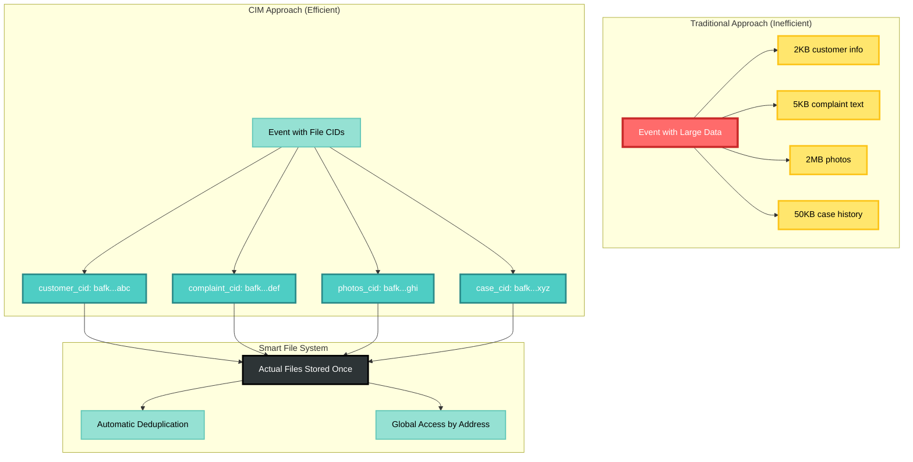
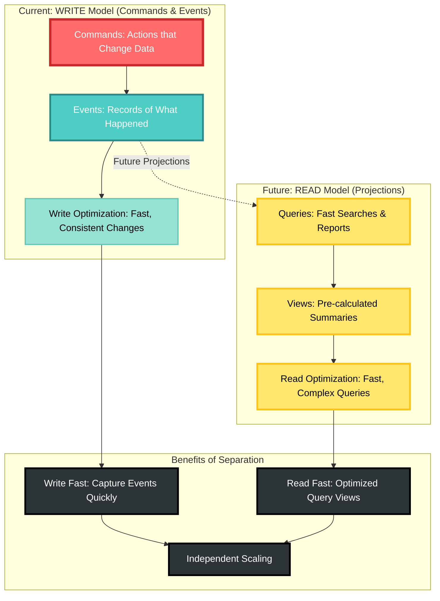

# CIM Object Store: Your Smart Network File System

**Copyright 2025 - Cowboy AI, LLC**

## Think of it Like a Smart Network Drive

The CIM Object Store works just like the network file systems you're already familiar with, but with some smart features that make it perfect for distributed applications.

## How It Works: Like URLs for Files

### Basic Concept
Instead of file paths like `/shared/documents/report.pdf`, every file gets a unique "web address" based on what's actually inside the file. Think of it like a URL, but instead of pointing to a website, it points to the exact content of a file.

**Example:**
```
Traditional file path: /shared/customer-data/john-doe-profile.json
Smart file address:    CID: bafk2bzaceabc123...def789 
To get file:          1. Subscribe to: domain.objects.get.bafk2bzaceabc123...def789 (listen for file)
                      2. Send command: domain.objects.get.bafk2bzaceabc123...def789 (receives ACK, triggers push)
```

### Why This is Better

**1. No Duplicate Files**
- If two people save the same customer photo, it only takes up space once
- The system automatically recognizes identical content and gives it the same address
- Your storage costs go down automatically

**2. Files Never Get Lost or Corrupted**
- Each file address is like a fingerprint of the content
- If someone tries to change a file, it gets a new address
- You always get exactly what the address promises

**3. Access Files from Anywhere**
- Request a file by its CID from any system using NATS
- No need to know which server or folder it's stored on
- Process: 1) Subscribe to `domain.objects.get.{CID}` (listen for file), 2) Send command `domain.objects.get.{CID}` (gets ACK, triggers push)

## Creating Folders: Combining Files Automatically



### Simple File Combination

Just like you can create folders that contain other files and folders, the Object Store automatically creates new addresses when you combine files together.

**Example: Customer Order**
```
Individual files:
- Customer info:     CID: bafk...abc 
  Get: 1) Subscribe domain.objects.get.bafk...abc → listen for file content
       2) Command domain.objects.get.bafk...abc → ACK + triggers push
- Product catalog:   CID: bafk...def
  Get: 1) Subscribe domain.objects.get.bafk...def → listen for file content  
       2) Command domain.objects.get.bafk...def → ACK + triggers push
- Order details:     CID: bafk...ghi
  Get: 1) Subscribe domain.objects.get.bafk...ghi → listen for file content
       2) Command domain.objects.get.bafk...ghi → ACK + triggers push

Combined automatically into:
- Complete order:    CID: bafk...xyz
  Get: 1) Subscribe domain.objects.get.bafk...xyz → listen for combined file
       2) Command domain.objects.get.bafk...xyz → ACK + triggers push of combined file
```

### Folder-like Organization

Think of it like this folder structure:

```
CustomerOrder_March2024/          ← CID: bafk...xyz 
├── customer-info.json           ← CID: bafk...abc
├── products/                    ← CID: bafk...def
│   ├── item1.json              ← CID: bafk...111
│   ├── item2.json              ← CID: bafk...222
│   └── item3.json              ← CID: bafk...333
└── payment/                     ← CID: bafk...ghi
    ├── transaction.json         ← CID: bafk...444
    └── receipt.pdf              ← CID: bafk...555

Access pattern for any CID:
1. Subscribe to: domain.objects.get.{CID} → listen for file content
2. Send command: domain.objects.get.{CID} → receive ACK + triggers push to subscription
```

**The Magic:** When you combine files, the system automatically creates a new CID for the combination. Access it via NATS like any other file. No manual work required!

## Real-World Examples

### Example 1: Customer Service Case

**What You Store:**
- Customer complaint (text document)
- Supporting photos (image files)
- Previous correspondence (email files)
- Resolution notes (text document)

**How It Works:**
1. Each item gets its own unique CID
2. The system automatically creates a "case folder" CID that contains all item CIDs
3. Anyone can access the complete case: first subscribe to `domain.objects.get.{case_CID}`, then send command (ACK + pushes case file to subscription)
4. If the same customer photo appears in multiple cases, it's only stored once (same CID)

### Example 2: Product Catalog

**What You Store:**
- Product descriptions (text files)
- Product images (image files)  
- Pricing information (data files)
- Customer reviews (text files)

**How It Works:**
1. Each product gets a folder CID containing all its file CIDs
2. The main catalog gets a CID containing all product folder CIDs
3. Updates create new CIDs, old versions remain accessible via their original CIDs
4. Identical product images across products automatically share the same CID

### Example 3: Analytics Reports

**What You Store:**
- Raw data files (databases, CSV files)
- Generated charts (image files)
- Report summaries (PDF files)
- Historical comparisons (data files)

**How It Works:**
1. Raw data gets CIDs, reports reference those CIDs
2. Multiple reports can share the same raw data files (same CID)
3. Report packages get their own CID containing all component CIDs
4. Historical reports remain accessible: subscribe first, then command pattern for any CID

## Integration with CIM Events

### How Events Reference Files

Instead of copying large files into every event, events just reference file addresses:



**Traditional Approach (Inefficient):**
```json
{
  "event": "CustomerComplaintReceived",
  "timestamp": "2024-03-15T10:30:00Z",
  "customer_data": { /* 2KB of customer info */ },
  "complaint_text": "/* 5KB of complaint details */",
  "support_photos": [ /* 2MB of image data */ ],
  "previous_cases": [ /* 50KB of case history */ ]
}
```

**CIM Approach (Efficient):**
```json
{
  "event": "CustomerComplaintReceived", 
  "timestamp": "2024-03-15T10:30:00Z",
  "case_data_cid": "bafk...xyz",
  "customer_cid": "bafk...abc",  
  "photos_cid": "bafk...def"
}
```

**To retrieve any referenced file:**
```javascript
// Step 1: Subscribe FIRST to listen for pushed file content
nats.subscribe(`domain.objects.get.${cid}`, (file_content) => {
  // Handle the actual file data when it arrives
});

// Step 2: Send command (receives ACK and triggers push to subscription)
nats.publish(`domain.objects.get.${cid}`, {});
```

**Benefits:**
- Events stay small and fast
- Large files are shared efficiently  
- Everything is still accessible via NATS subscribe-first + command pattern

## CQRS and Domain-Driven Design Context



### Current Focus: WRITE Model

Right now, CIM-Start is focused on the **WRITE side** of CQRS (Command Query Responsibility Segregation):

**What This Means:**
- **Commands**: Actions that change data (Create Customer, Place Order, Update Inventory)
- **Events**: Records of what happened (Customer Created, Order Placed, Inventory Updated)
- **Write Optimization**: The system is optimized for handling changes quickly and consistently

### Coming Later: READ Model (Projections)

The **READ side** will be added later as Projections from the Event Store:

**What This Will Include:**
- **Queries**: Fast searches and reports (Find all orders from last month)  
- **Views**: Pre-calculated summaries (Customer dashboards, sales reports)
- **Read Optimization**: Optimized for fast queries and complex reporting

**Why This Separation Helps:**
- **Write Fast**: Focus on capturing business events quickly and accurately
- **Read Fast**: Later, create optimized views for different types of queries
- **Independent Scaling**: Scale writing and reading independently based on needs

### Domain-Driven Design Integration

The Object Store supports DDD concepts naturally:

**Aggregates**: Business objects get their own CIDs
**Value Objects**: Small data items get CIDs and can be shared
**Domain Events**: Reference CIDs instead of copying large payloads
**Bounded Contexts**: Each domain can have its own file organization patterns

## Getting Started

### Step 1: Create Your Domain
Use the Domain Creation process to establish your domain boundary and communication patterns.

### Step 2: Store Your First Files  
Large payloads (databases, images, documents) automatically get CIDs in the Object Store.

### Step 3: Reference in Events
Events will reference CIDs instead of including large payloads directly.

### Step 4: Combine as Needed
Related files automatically get combined into logical groups with their own CIDs.

### Step 5: Retrieve Files
Get any file using the two-step NATS pattern:
1. Subscribe to: `domain.objects.get.{CID}` (listen for pushed file content)
2. Send command: `domain.objects.get.{CID}` (receives ACK, triggers push to subscription)

## Security: Claims-Based Authorization

### Per-Object Authorization Claims
Every object in the CIM Object Store has its own set of authorization claims that control access:

**Standard Claims per CID:**
- **READ**: Permission to retrieve file content via `domain.objects.get.{CID}`
- **WRITE**: Permission to store/update file content via `domain.objects.put.{CID}`
- **METADATA**: Permission to access file metadata (size, type, creation date, etc.)
- **REMOVE**: Permission to delete/remove the object from the store

**Claims Structure Example:**
```json
{
  "cid": "bafk2bzaceabc123...def789",
  "claims": {
    "read": ["user:alice", "role:customer-service", "domain:sales"],
    "write": ["user:alice", "role:admin"],
    "metadata": ["user:alice", "role:customer-service", "role:analyst"],
    "remove": ["role:admin", "user:alice"]
  }
}
```

### How Claims Work with NATS
- **Authentication**: User/service must present valid claims when accessing objects
- **Authorization Check**: System validates claims before processing NATS commands
- **Granular Control**: Different permissions for different operations on the same object
- **Distributed Security**: Claims travel with object references across domain boundaries

### Claims Inheritance
- **Folder Objects**: Claims can be inherited from parent folder CIDs to child file CIDs
- **Domain Scoping**: Claims can be scoped to specific domains for cross-domain access control
- **Role-Based**: Claims support both individual users and role-based access

## Technical Details (For the Curious)

### Under the Hood
- Files are organized in tree structures (like folders within folders)
- Each file and folder gets a cryptographic fingerprint as its CID
- Identical content automatically gets the same CID (deduplication)
- The system uses content verification to ensure data integrity
- **Claims-based security**: Every object has associated authorization claims for granular access control

### Network Distribution
- Files can be retrieved from any system on the network via NATS
- Content verification ensures you always get the right data
- Automatic caching improves performance
- No central point of failure

### Integration with NATS
- **File retrieval**: Two-step process using `domain.objects.get.{CID}`
  1. Subscribe to subject → listen for pushed file content
  2. Publish command → receive ACK + triggers push to subscription (requires READ claim)
- **File storage**: Through NATS subjects: `domain.objects.put.{CID}` (requires WRITE claim)
- **CID sharing**: CIDs can be shared in NATS messages for efficient referencing
- **Distributed access**: Any system can access files via the subscribe-first + command pattern (subject to claims-based authorization)

## Summary

The CIM Object Store gives you:

1. **Familiar Interface**: Works like network file systems you already know
2. **Smart Features**: Automatic deduplication, content verification, NATS-based access
3. **Efficient Storage**: Large files stored once, referenced many times via CIDs
4. **Simple Integration**: CIDs work seamlessly with events and messaging
5. **Future-Proof**: Ready for read models and projections when you need them

Think of it as your smart network drive that automatically organizes itself, prevents duplicates, and makes files accessible from anywhere in your distributed system via the NATS subscribe-first + command pattern.