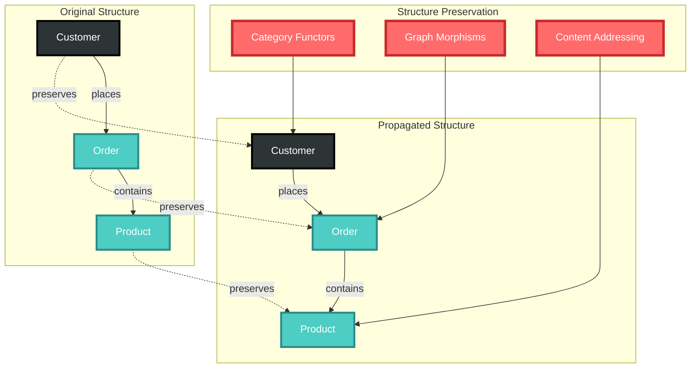
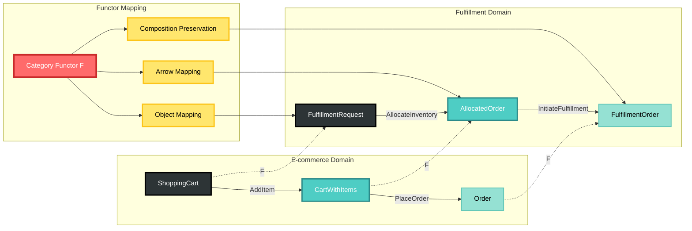

# Structure-Preserving Propagation in CIM Systems

**Copyright 2025 - Cowboy AI, LLC**

## Abstract

This document explains how mathematical structures in CIM systems maintain their essential properties as they propagate through distributed environments. The preservation of structure is not accidental but fundamental to the mathematical foundations of Category Theory, Graph Theory, and Content-Addressed Storage.

## What is Structure-Preserving Propagation?

**Structure-preserving propagation** means that when mathematical objects move through a system—across networks, between processes, through transformations—their essential structural properties remain intact. This is achieved through the mathematical concept of **morphisms** and **functors** that preserve the relationships and properties that define the structure.



## The Three Pillars of Structure Preservation

### 1. Category Theory: Compositional Preservation

**Functors Preserve Category Structure**

When a Domain (Category) communicates with another Domain, it does so through **functors**—structure-preserving mappings between categories.

```yaml
# Functor F: Domain_A → Domain_B preserves:

# Object Mapping:
F(Customer_A) = Customer_B          # Entities map to compatible entities
F(Order_A) = Order_B               # Objects preserve their essential nature

# Arrow Mapping:  
F(CreateOrder_A) = CreateOrder_B   # Systems map to compatible systems
F(ProcessPayment_A) = ProcessPayment_B  # Morphisms preserve composition

# Composition Preservation:
F(g ∘ f) = F(g) ∘ F(f)            # System chains remain valid across domains

# Identity Preservation:
F(id_A) = id_B                     # Entity identities are maintained
```

**Real-World Example:**
```yaml
# E-commerce Domain communicating with Fulfillment Domain:
ecommerce_to_fulfillment:
  functor: "OrderProcessingFunctor"
  
  object_mapping:
    ShoppingCart → FulfillmentOrder
    Customer → ShippingAddress  
    PaymentMethod → BillingInfo
    
  arrow_mapping:
    PlaceOrder → InitiateFulfillment
    ProcessPayment → AuthorizeShipping
    SendConfirmation → TrackPackage
    
  # Mathematical guarantee: 
  # PlaceOrder ∘ AddToCart maps to InitiateFulfillment ∘ CreateOrder
  # The composition structure is preserved across domain boundaries
```

**Category Functor Visualization:**



### 2. Graph Theory: Topological Preservation

**Graph Morphisms Maintain Connectivity**

When graph data moves between systems, **graph morphisms** ensure that the essential connectivity and relationship structure is preserved.

```yaml
# Graph Morphism φ: Graph_A → Graph_B preserves:

# Node Mapping:
φ(customer_node_A) = customer_node_B    # Entities maintain their role
φ(order_node_A) = order_node_B         # Objects preserve their identity

# Edge Mapping:
φ(places_order_edge_A) = places_order_edge_B  # Relationships are maintained
φ(contains_item_edge_A) = contains_item_edge_B # Connections stay consistent

# Adjacency Preservation:
# If customer_A --places_order--> order_A
# Then φ(customer_A) --places_order--> φ(order_A)
# Connected things stay connected through the transformation
```

**Real-World Example:**
```yaml
# Customer graph distributed across multiple systems:
original_graph:
  nodes: [customer_123, order_456, item_789, payment_101]
  edges: 
    - customer_123 --places--> order_456
    - order_456 --contains--> item_789
    - order_456 --paid_with--> payment_101

# After distribution to fulfillment system:
distributed_graph:
  nodes: [customer_123_remote, order_456_remote, item_789_remote, payment_101_remote]
  edges:
    - customer_123_remote --places--> order_456_remote
    - order_456_remote --contains--> item_789_remote  
    - order_456_remote --paid_with--> payment_101_remote
    
# Graph morphism guarantees:
# - All relationships are preserved
# - Path properties remain valid (customer can still reach items through order)
# - Graph algorithms work identically on both representations
```

### 3. IPLD: Content-Addressed Preservation

**Cryptographic Content Integrity**

Content-addressed storage using IPLD ensures that data maintains its integrity and identity through cryptographic guarantees.

```yaml
# IPLD Link Structure Preservation:

# Content Identity:
content → hash(content) = CID
# Identical content always produces identical CID
# Content integrity is cryptographically guaranteed

# Reference Integrity:
event_A:
  payload_cid: "bafybeigdyrzt5sfp7udm7hu76uh7y26nf3efuylqabf3oclgtqy55fbzdi"
  
event_B:  # On different system
  payload_cid: "bafybeigdyrzt5sfp7udm7hu76uh7y26nf3efuylqabf3oclgtqy55fbzdi"
  
# Mathematical guarantee: 
# Both events reference identical content
# Content can be retrieved from either location
# Integrity is verifiable through CID validation
```

**Real-World Example:**
```yaml
# Large customer database shared across domains:
original_storage:
  content: {customer_database: [...large data...]}
  cid: "bafybeigdyrzt5sfp7udm7hu76uh7y26nf3efuylqabf3oclgtqy55fbzdi"
  
# Referenced from multiple events across the system:
order_event:
  customer_data_cid: "bafybeigdyrzt5sfp7udm7hu76uh7y26nf3efuylqabf3oclgtqy55fbzdi"
  
fulfillment_event:
  customer_data_cid: "bafybeigdyrzt5sfp7udm7hu76uh7y26nf3efuylqabf3oclgtqy55fbzdi"
  
analytics_event:
  customer_data_cid: "bafybeigdyrzt5sfp7udm7hu76uh7y26nf3efuylqabf3oclgtqy55fbzdi"

# IPLD guarantees:
# - All events reference identical content
# - Content is stored once, referenced many times (deduplication)
# - Content integrity is cryptographically verified
# - Retrieval is location-independent
```

## How Structure Propagates Through CIM Systems

### 1. Inter-Domain Communication

**Category Functors Handle Domain Boundaries**

```yaml
# When OrderDomain communicates with FulfillmentDomain:
communication_flow:
  - OrderDomain creates OrderPlacedEvent
  - Event contains CID references to customer data, product data
  - CategoryFunctor maps OrderDomain objects to FulfillmentDomain objects
  - Graph morphism preserves customer→order→product relationships
  - IPLD ensures content integrity across domain boundaries
  - FulfillmentDomain receives mathematically valid, structure-preserved data
```

### 2. Event Sourcing with Structure Preservation

**Event Store Maintains Mathematical Consistency**

```yaml
# Event Stream with structure preservation:
event_sequence:
  - event_1:
      type: "CustomerCreated"
      node_type: "Entity"
      payload_cid: "bafk...customer_data"
      graph_position: "root_node"
      
  - event_2:
      type: "OrderPlaced"
      edge_type: "System"
      source_node_cid: "bafk...customer_data"
      target_node_cid: "bafk...order_data"
      morphism: "places_order"
      
  - event_3:
      type: "PaymentProcessed"
      edge_type: "System"
      source_node_cid: "bafk...order_data"
      target_node_cid: "bafk...payment_data"
      morphism: "processes_payment"

# Mathematical guarantee:
# - Category composition: CustomerCreated → OrderPlaced → PaymentProcessed forms valid morphism chain
# - Graph structure: Customer node → Order node → Payment node maintains connectivity
# - IPLD integrity: All CID references point to immutable, verified content
```

### 3. Distributed Graph Operations

**Graph Algorithms Work Uniformly Across Distribution**

```yaml
# Shortest path query across distributed graph:
query: "Find shortest path from Customer to DeliveryStatus"

# Path discovery (works identically whether data is local or distributed):
path_result:
  - customer_node (CID: bafk...customer)
    --places_order-->
  - order_node (CID: bafk...order)  
    --initiates_fulfillment-->
  - fulfillment_node (CID: bafk...fulfillment)
    --tracks_delivery-->
  - delivery_node (CID: bafk...delivery)

# Structure preservation guarantees:
# - Path exists regardless of physical data location
# - Graph traversal works identically on distributed data
# - CID references ensure data consistency across nodes
# - Mathematical properties (shortest path) are preserved
```

## Practical Benefits of Structure Preservation

### 1. Seamless Distribution

**Code Works Identically Everywhere**

```yaml
# Same code works whether data is local or distributed:
def find_customer_orders(customer_id):
    customer_node = graph.get_node(customer_id)
    order_edges = graph.get_outgoing_edges(customer_node, "places_order")
    return [edge.target for edge in order_edges]

# This function works identically whether:
# - All data is local
# - Customer is on one system, orders on another  
# - Graph is distributed across multiple regions
# Structure preservation makes distribution transparent
```

### 2. Automatic Consistency

**Mathematical Properties Prevent Inconsistency**

```yaml
# Inconsistent state is mathematically impossible:
impossible_state:
  - customer_node exists
  - order_node claims to be placed by customer
  - but no edge connects customer to order
  
# Graph morphism preservation guarantees:
# If customer --places_order--> order exists in source
# Then φ(customer) --places_order--> φ(order) exists in target
# Broken relationships cannot survive structure-preserving transformations
```

### 3. Predictable Behavior

**Mathematical Laws Enable Reasoning**

```yaml
# Composition law guarantees:
customer_to_item_path:
  customer --places_order--> order --contains--> item

# This composition is mathematically guaranteed to equal:
composed_morphism:
  customer --customer_to_item--> item

# Enabling optimizations:
# - Path can be pre-computed
# - Intermediate steps can be cached  
# - Distributed queries can be optimized
# - All based on mathematical certainty
```

## Structure Preservation in Action: Complete Example

### E-commerce Order Processing Across Three Domains

**Domain Architecture:**
```yaml
domains:
  - sales_domain:
      purpose: "Handle customer purchases"
      objects: [Customer, ShoppingCart, Order]
      systems: [AddToCart, PlaceOrder, ProcessPayment]
      
  - fulfillment_domain:
      purpose: "Process and ship orders"
      objects: [FulfillmentOrder, Inventory, Shipment] 
      systems: [AllocateInventory, PackOrder, ShipOrder]
      
  - analytics_domain:
      purpose: "Analyze customer behavior"
      objects: [CustomerProfile, PurchasePattern, Recommendation]
      systems: [AnalyzePurchase, GenerateRecommendations]
```

**Step 1: Customer Places Order (Sales Domain)**
```yaml
# Mathematical structure created:
sales_graph:
  nodes:
    - customer_123: {cid: "bafk...customer_data"}
    - shopping_cart_456: {cid: "bafk...cart_data"}  
    - order_789: {cid: "bafk...order_data"}
  
  edges:
    - customer_123 --owns--> shopping_cart_456
    - customer_123 --places--> order_789
    - shopping_cart_456 --becomes--> order_789

# Event store records:
events:
  - type: "OrderPlaced"
    customer_cid: "bafk...customer_data"
    order_cid: "bafk...order_data" 
    morphism_chain: "owns ∘ places"
```

**Step 2: Order Sent to Fulfillment (Cross-Domain Communication)**
```yaml
# Category functor: Sales → Fulfillment
functor_mapping:
  objects:
    Customer → ShippingAddress
    Order → FulfillmentOrder
    
  arrows:
    PlaceOrder → InitiateFulfillment
    
# Structure preservation result:
fulfillment_graph:
  nodes:
    - shipping_address_123: {cid: "bafk...address_data"} # derived from customer
    - fulfillment_order_789: {cid: "bafk...fulfillment_data"} # derived from order
    
  edges:
    - shipping_address_123 --ships_to--> fulfillment_order_789
    
# Mathematical guarantee:
# Original: customer --places--> order
# Preserved: shipping_address --ships_to--> fulfillment_order
# The relationship structure is maintained across domains
```

**Step 3: Analytics Processing (Cross-Domain Analysis)**
```yaml
# Category functor: Sales → Analytics  
analytics_functor:
  objects:
    Customer → CustomerProfile
    Order → PurchaseEvent
    
  arrows:
    PlaceOrder → RecordPurchase
    
# Structure preservation result:
analytics_graph:
  nodes:
    - customer_profile_123: {cid: "bafk...profile_data"}
    - purchase_event_789: {cid: "bafk...purchase_data"}
    
  edges:
    - customer_profile_123 --made_purchase--> purchase_event_789

# All three domains maintain the core relationship:
# Sales: customer --places--> order
# Fulfillment: shipping_address --ships_to--> fulfillment_order
# Analytics: customer_profile --made_purchase--> purchase_event

# The essential structure propagates perfectly across all domains
```

**Step 4: IPLD Content Sharing**
```yaml
# Customer data referenced across all domains:
shared_content:
  customer_data:
    cid: "bafk...customer_data"
    content: {name: "John Doe", address: "123 Main St", ...}
    
  referenced_by:
    - sales_domain: "customer_123 node"
    - fulfillment_domain: "shipping_address derivation"  
    - analytics_domain: "customer_profile_123 node"
    
# IPLD guarantees:
# - Content stored once, referenced three times
# - All domains access identical data  
# - Content integrity cryptographically verified
# - Automatic deduplication across system
```

## Conclusion: Mathematics Enables Effortless Distribution

Structure-preserving propagation through mathematical constructs provides:

1. **Automatic Consistency**: Mathematical laws prevent inconsistent states
2. **Transparent Distribution**: Code works identically whether data is local or distributed  
3. **Guaranteed Integrity**: Cryptographic content addressing ensures data validity
4. **Predictable Behavior**: Mathematical properties enable reasoning about system behavior
5. **Natural Composition**: Systems compose correctly through mathematical guarantees

The result is a distributed system that feels effortless to develop and operate, because the mathematics handles the complexity of maintaining structure across network boundaries, process boundaries, and time boundaries.

**Mathematical structures don't just preserve their properties—they actively enforce system correctness**, making distributed domain-driven design as natural as working with mathematical objects themselves.