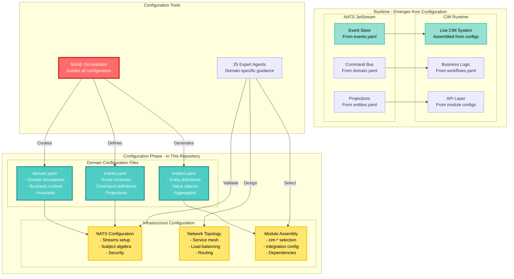
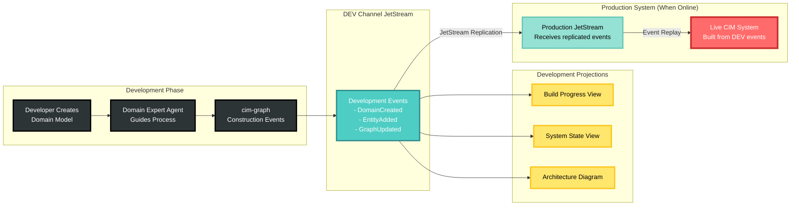
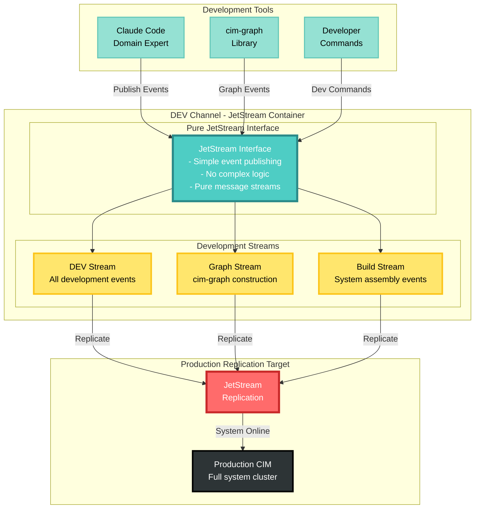

# CIM-Start: Configuration-Driven CIM Development Platform

Copyright 2025 - Cowboy AI, LLC

## 🎯 **Build Your CIM Through Configuration**

**CIM-Start is a configuration platform for creating Composable Information Machines - you define your CIM through configuration, not code.**

Starting from this repository, you will:
1. **Configure your domain** → Define your CIM structure and boundaries
2. **Add infrastructure configuration** → NATS JetStream, network topology, security
3. **Assemble cim-* modules** → Use 38+ pre-built modules (not build from scratch)
4. **Deploy your configured CIM** → Event-driven system emerges from configuration

## 🤖 Meet SAGE - Your Configuration Orchestrator

CIM-Start provides **SAGE**, an intelligent agent system that guides you through CIM configuration. SAGE coordinates 25 specialized experts to help you configure, assemble, and deploy your CIM.

**🎯 Working with SAGE - Context First:**
```bash
# After cloning with your domain name:
@sage Initialize domain context for order-processing
@sage Create domain.json with my organization's details
@sage Configure infrastructure based on our resources
@sage Define domain boundaries after context is established
@sage Assemble the right cim-* modules for my domain
```

**SAGE automatically:**
- **Guides configuration** → Creates domain objects, graphs, and workflows
- **Sets up infrastructure** → Configures NATS JetStream, network topology
- **Assembles modules** → Selects and integrates cim-* ecosystem components
- **Validates architecture** → Ensures proper event-driven patterns
- **Manages the complete configuration journey** → From empty repo to running CIM

## 🚀 Domain-First, Configuration-Driven Development

CIM-Start provides **domain-context-first, configuration-driven CIM development**:

- **Domain Context Data** - Establish People, Organizations, and Resources BEFORE infrastructure
- **Domain Configuration** - Define your CIM structure through YAML/JSON configuration
- **Infrastructure as Configuration** - NATS, network topology, security configured based on context  
- **Module Assembly Configuration** - Select and configure pre-built cim-* modules
- **Event Flow Configuration** - Define event streams, projections, and workflows
- **Mathematical Foundation** - Category Theory, Graph Theory, and IPLD built-in
- **Context-Aware Deployment** - Infrastructure adapts to your resource specifications

## 🎯 How to Configure Your CIM - Domain Context First!

**Step 1: Clone and Name Your Domain**
```bash
# Clone the repository with YOUR domain name
git clone https://github.com/TheCowboyAI/cim-start.git inventory-management
cd inventory-management
# Your repo name "inventory-management" becomes your Domain name
```

**Step 2: Initialize SAGE Configuration System**
```bash
# Initialize Claude Code with SAGE and all expert agents
claude init
# SAGE detects "inventory-management" as your domain name
```

**Step 3: CRITICAL - Create Domain Context Data First**
```bash
# Before ANY infrastructure, establish Domain context!
@sage Create domain context for inventory-management

# You MUST provide:
# 1. Domain Purpose: Clear description of what this CIM does
# 2. People: Who will administer and use the system
# 3. Organizations: Who owns/operates the domain
# 4. Resources: Where to deploy (local/VM/container/metal/cloud)
```

This creates `domains/inventory-management/domain.json` with essential context.

**Step 4: Infrastructure Based on Context**
```bash
# Only AFTER domain.json exists:
@sage Configure infrastructure based on my domain context

# SAGE reads your context and:
# - Creates appropriate Nix flake if deployment_target != "local"
# - Configures NATS based on resource specifications
# - Sets up networking according to your organization's needs
```

**Step 5: Configure Your Domain with SAGE**
Now you can start actual CIM configuration:



### Configuration-Driven Development Workflow



### DEV Channel Architecture: Pure JetStream Interface



**Key Benefits of DEV Channel Architecture:**
- **Pure JetStream Interface**: Simple, lightweight development environment
- **Complete Development Capture**: Every build step recorded as events
- **Seamless Replication**: DEV channel events flow directly to production
- **No Development Overhead**: Just publish events, JetStream handles the rest
- **Event-Driven Construction**: Use cim-graph to build CIM through events
- **Live Production Ready**: Development events become production system memory

## 📁 Project Structure

```
cim-start/
├── .github/          # GitHub workflows and templates
├── agents/           # CIM agent configurations
│   ├── system/       # System agents (monitoring, ops)
│   ├── integration/  # Integration agents (APIs, sync)
│   ├── ai/          # AI agents (NLP, ML, decision making)  
│   ├── user/        # User agents (workflows, notifications)
│   ├── templates/   # Agent configuration templates
│   ├── examples/    # Complete agent integration examples
│   └── schemas/     # JSON schemas for agent validation
├── doc/             # Domain documentation and guides
│   ├── quick-start.md
│   ├── event-storming-guide.md
│   ├── nats-setup.md
│   └── agents-guide.md
├── domains/         # Your domain definitions
│   └── example-business/
└── docker-compose.yml  # NATS infrastructure
```

## 🚀 Getting Started - Domain Context First!

### Step 1: Clone with Your Domain Name

**Your repository name becomes your domain name:**

```bash
# Clone with YOUR domain name (this is critical!)
git clone https://github.com/TheCowboyAI/cim-start.git ecommerce
cd ecommerce
# "ecommerce" is now your Domain name
```

### Step 2: Initialize SAGE

```bash
# Initialize SAGE and expert agents
claude init
# SAGE detects "ecommerce" as your domain name
```

### Step 3: MANDATORY - Create Domain Context

**Before ANY configuration or infrastructure:**

```bash
# Create your domain.json with context data
@sage Initialize domain context for ecommerce

# Provide required information:
# - Purpose: "Manage online retail operations"
# - People: [{"name": "Jane Doe", "role": "Admin", "email": "jane@shop.com"}]
# - Organizations: [{"name": "Shop Inc", "type": "owner"}]
# - Resources: {"deployment_target": "container", "nats": {"location": "local"}}

# This creates: domains/ecommerce/domain.json
```

### Step 4: Configure Infrastructure Based on Context

**Only AFTER domain.json exists:**

```bash
# SAGE reads your context and configures appropriately
@sage Configure infrastructure for ecommerce domain

# Based on deployment_target in domain.json:
# - "local": Uses existing NATS installation
# - "vm": Creates Nix flake for VM deployment
# - "container": Configures Docker/Kubernetes
# - "cloud": Sets up cloud provider resources
# - "metal": Configures bare metal deployment
```

### Step 5: Domain Configuration

**Now you can configure the actual domain:**

```bash
# With context and infrastructure ready:
@sage Configure domain model for ecommerce

# This creates:
# - domains/ecommerce/entities.yaml
# - domains/ecommerce/events.yaml
# - domains/ecommerce/workflows.yaml
```

## 🏗️ Working with CIM-Start

### Domain Context Structure

Every CIM starts with a `domain.json` file containing:

```json
{
  "domain": {
    "name": "${REPO_NAME}",
    "purpose": "Clear description of domain's role"
  },
  "context": {
    "people": [
      {"name": "Admin Name", "role": "Domain Administrator", "email": "admin@org.com"}
    ],
    "organizations": [
      {"name": "Your Org", "type": "owner", "role": "Domain Owner"}
    ],
    "resources": {
      "infrastructure": {
        "deployment_target": "local|vm|container|metal|cloud",
        "nats": {"location": "local|remote", "host": ""}
      }
    }
  }
}
```

### The SAGE Agent System

**🧙‍♂️ SAGE - Your Master CIM Orchestrator**
- Single entry point for all CIM development tasks
- Analyzes your needs and coordinates appropriate experts
- Manages multi-agent workflows for complex CIM creation
- Provides unified guidance synthesized from 25 specialized experts

**The Complete Expert Team (SAGE coordinates these automatically):**

**🏗️ Domain & Architecture Experts:**
- **@cim-expert** - CIM architecture and mathematical foundations
- **@cim-domain-expert** - CIM domain-specific architecture and integration
- **@ddd-expert** - Domain boundaries and aggregate design
- **@event-storming-expert** - Collaborative domain discovery
- **@domain-expert** - Final domain creation and validation
- **@domain-ontologist-researcher** - Domain ontologies and knowledge structures

**🧪 Development & Testing Experts:**
- **@bdd-expert** - Behavior-Driven Development and Gherkin scenarios
- **@tdd-expert** - Test-Driven Development and unit testing
- **@qa-expert** - Quality assurance and compliance validation

**🌐 Infrastructure & Systems Experts:**
- **@nats-expert** - NATS infrastructure and security
- **@network-expert** - Network topology design
- **@nix-expert** - Declarative system configuration
- **@git-expert** - Git operations and CI/CD workflows
- **@subject-expert** - CIM subject algebra and routing patterns

**🎨 UI/UX & Visualization Experts:**
- **@iced-ui-expert** - Iced GUI framework for desktop apps
- **@elm-architecture-expert** - Elm Architecture patterns
- **@cim-tea-ecs-expert** - TEA + ECS integration patterns
- **@ricing-expert** - System customization and theming

**🧠 Knowledge & Semantic Experts:**
- **@conceptual-spaces-expert** - Gärdenfors' geometric semantic spaces
- **@graph-expert** - Graph theory and network analysis
- **@language-expert** - Natural language processing and linguistics

**👥 Organization & Context Experts:**
- **@people-expert** - User modeling and personas
- **@org-expert** - Organizational structures and workflows
- **@location-expert** - Spatial and geographic modeling

### Configuration-First Workflow with SAGE

**🎯 Primary Workflow: Configure Your CIM with SAGE**
```bash
# Start configuration in this repository
@sage I need to configure a CIM for [business domain]

# SAGE creates configuration files, not code:
# - domains/[domain]/domain.yaml
# - domains/[domain]/entities.yaml  
# - domains/[domain]/events.yaml
# - nats-config/streams.yaml
# - cim-modules.yaml

# Examples:
@sage Configure a CIM for my e-commerce business
@sage Set up domain configuration for order processing
@sage Configure NATS infrastructure and event streams
@sage Select cim-* modules for my inventory system
```

**🔧 Advanced: Direct Expert Access (when you know exactly what you need)**
```bash
# Domain discovery and analysis
/eventstorming order processing and fulfillment
/ddd analyze these event storming results

# Infrastructure configuration
/nats configure streams and security for my domain
/network set up topology with cim-network MCP  
/nix generate system configuration from events

# Final domain creation
/domain create complete cim-graph structure
```

**⚙️ Manual Setup (legacy approach, not recommended)**
- Manual infrastructure setup with make dev
- Manual agent coordination
- Manual workflow management

## 🐳 NATS JetStream Setup

### Docker Compose (Quickest)
```yaml
# docker-compose.yml provided
# Includes:
# - NATS server with JetStream
# - Monitoring dashboard
# - Persistent storage
```

### NixOS VM (Production-like)
```bash
# Build and run VM with NATS
nix build .#nats-vm
./result/bin/run-nats-vm
```

### Local Development
```bash
# Install NATS locally
nix develop
nats-server -js
```

## 📚 Documentation

- `CLAUDE.md` - **Claude Code development guide** with commands and patterns
- `/doc/domain-creation-mathematics.md` - Mathematical foundations (Category Theory, Graph Theory, IPLD)
- `/doc/object-store-user-guide.md` - Smart file system with CID patterns
- `/doc/structure-preserving-propagation.md` - How mathematical structures propagate
- `/agents/README.md` - Agent architecture overview

## 🤖 Claude Code Integration

CIM-Start is designed to work seamlessly with Claude Code:

### Why Use Claude Code with CIM-Start?

1. **Template-Based Setup**: Use this repo as a GitHub template, then run `claude init`
2. **Expert Agents**: Get specialized guidance from `@cim-expert` and `@domain-expert`
3. **Interactive Domain Creation**: Convert business requirements into mathematical CIM structures
4. **Architecture Guidance**: Understand Category Theory, Graph Theory, and IPLD foundations
5. **Schema-Compliant Output**: Generate cim-graph library compatible events automatically

### The 25 Expert Agents Available After `claude init`

SAGE orchestrates a comprehensive team of 25 specialized experts:

**Domain & Architecture** (6 experts): CIM architecture, domain design, event storming, ontologies
**Development & Testing** (3 experts): BDD, TDD, quality assurance
**Infrastructure** (5 experts): NATS, networking, Nix, Git, subject algebra
**UI/UX** (4 experts): Iced, Elm, TEA+ECS, theming
**Knowledge & Semantics** (3 experts): Conceptual spaces, graphs, language
**Organization** (3 experts): People, organizations, locations
**Orchestration** (1 expert): SAGE master coordinator

### Getting Started is Simple

```bash
# 1. Use as GitHub template (don't clone)
# 2. Clone your new repository
# 3. Initialize Claude Code
claude init

# 4. Start working immediately
claude "@domain-expert I need to create a billing domain for my SaaS"
```

No complex setup, no configuration files to edit - the agents guide you through everything.

## 🔧 CIM Module Ecosystem - Assemble, Don't Build

**The CIM philosophy: ASSEMBLE existing modules, don't build from scratch**

CIM provides **38+ pre-built modules** that you configure and assemble:

### Configuration-Based Assembly
```yaml
# cim-modules.yaml - Module assembly configuration
modules:
  core:
    - name: cim-domain
      version: latest
      config: domains/myapp/domain.yaml
    - name: cim-graph
      version: latest
      config: domains/myapp/graph.yaml
    - name: cim-projections
      version: latest
      config: domains/myapp/projections.yaml
  
  domain:
    - name: cim-domain-identity
      version: latest
      config: domains/myapp/identity.yaml
    - name: cim-domain-policy
      version: latest
      config: domains/myapp/policies.yaml
  
  infrastructure:
    - name: cim-network
      version: latest
      config: infrastructure/network.yaml
    - name: cim-flashstor
      version: latest  
      config: infrastructure/storage.yaml
```

### Core Modules (Configure These First)
- `cim-domain` - Domain boundaries and event definitions
- `cim-projections` - Read model configurations
- `cim-graph` - Graph structures and workflows

### Domain Modules (Add As Needed)
- `cim-domain-identity` - User authentication configuration
- `cim-domain-policy` - Business rule definitions
- `cim-domain-location` - Geographic and spatial configs
- `cim-domain-person` - Person entity management
- `cim-domain-organization` - Org structure configs

### Infrastructure Modules (Platform Layer)
- `cim-network` - Network topology configuration
- `cim-flashstor` - Object storage settings
- `cim-security` - Authorization policies

**SAGE helps you select and configure the right modules:**
```bash
@sage What modules do I need for e-commerce?
@sage Configure cim-domain-identity for my use case
@sage Help me assemble modules for order processing
```

## 🎓 Learning Path

1. **Start Simple**: One aggregate, 3-5 events
2. **Add Complexity**: Multiple aggregates, policies
3. **Cross-Domain**: Integration with other domains
4. **Production**: Clustering, monitoring, deployment

## 📖 Example Domain

See `/domains/example-business/` for a complete e-commerce domain with:
- Customer registration
- Product catalog
- Order management
- Inventory tracking
- Fulfillment workflow

## 🚦 Quick Start Process - Domain Context First!

1. **Clone with YOUR domain name:**
   ```bash
   git clone https://github.com/TheCowboyAI/cim-start.git restaurant-ordering
   cd restaurant-ordering
   # "restaurant-ordering" is now your Domain name
   ```

2. **Initialize SAGE and expert agents:**
   ```bash
   claude init
   # SAGE detects "restaurant-ordering" as domain name
   ```

3. **MANDATORY - Create Domain Context First:**
   ```bash
   # This MUST happen before ANY infrastructure!
   @sage Initialize domain context for restaurant-ordering
   
   # Provide:
   # - Purpose: "Manage restaurant orders and delivery"
   # - People: [{"name": "Admin Name", "role": "Administrator"}]
   # - Organizations: [{"name": "Restaurant Inc", "type": "owner"}]
   # - Resources: {"deployment_target": "container"}
   
   # Creates: domains/restaurant-ordering/domain.json
   ```

4. **Configure Infrastructure Based on Context:**
   ```bash
   # SAGE reads domain.json and configures accordingly
   @sage Set up infrastructure for restaurant-ordering
   
   # Creates appropriate configuration based on deployment_target:
   # - Local: Uses existing NATS
   # - VM/Container: Creates Nix flake
   # - Cloud/Metal: Configures provider resources
   ```

5. **Configure Domain and Launch:**
   ```bash
   # Now configure the actual domain
   @sage Configure domain model for restaurant-ordering
   @sage Select cim-* modules for order processing
   
   # Launch your configured CIM
   make dev  # or nix run .#domain-vm for VM deployment
   ```

**What gets created:**
   - `domains/restaurant-ordering/domain.json` - Context data (FIRST!)
   - `domains/restaurant-ordering/*.yaml` - Domain configuration
   - `flake.nix` - Infrastructure definition (if not local)
   - `cim-modules.yaml` - Module assembly configuration
   - **Context drives everything** - Infrastructure adapts to your resources

## 📝 License

MIT

## 🤝 Contributing

Contributions welcome! Please read our contributing guidelines.

## 💬 Support

- GitHub Issues: [Report bugs or request features]
- Documentation: [Full CIM documentation]
- Community: [Join our Discord]