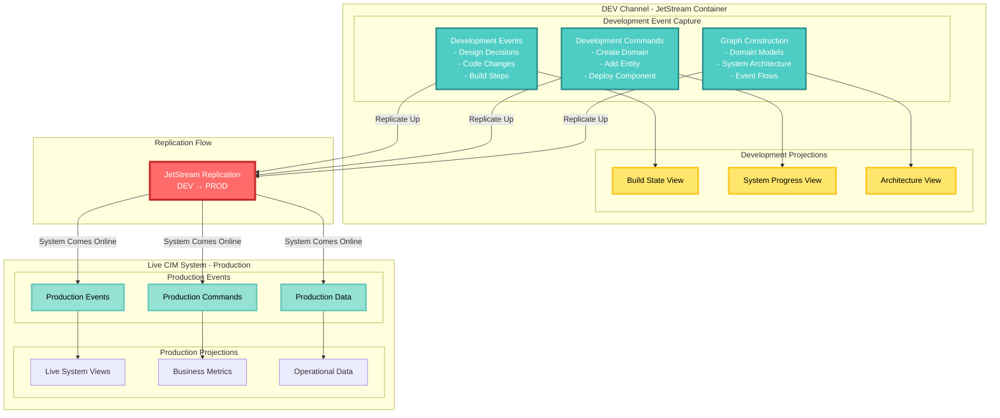
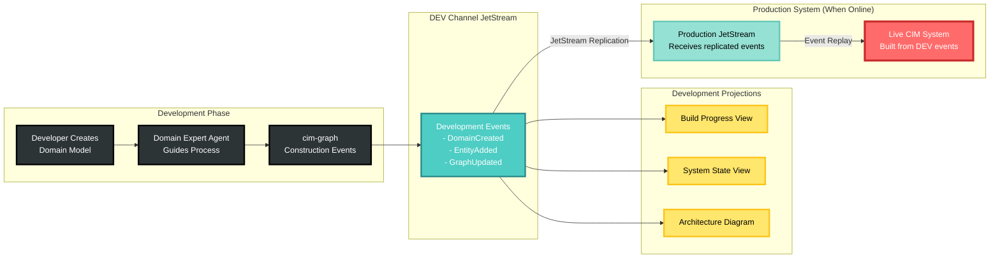
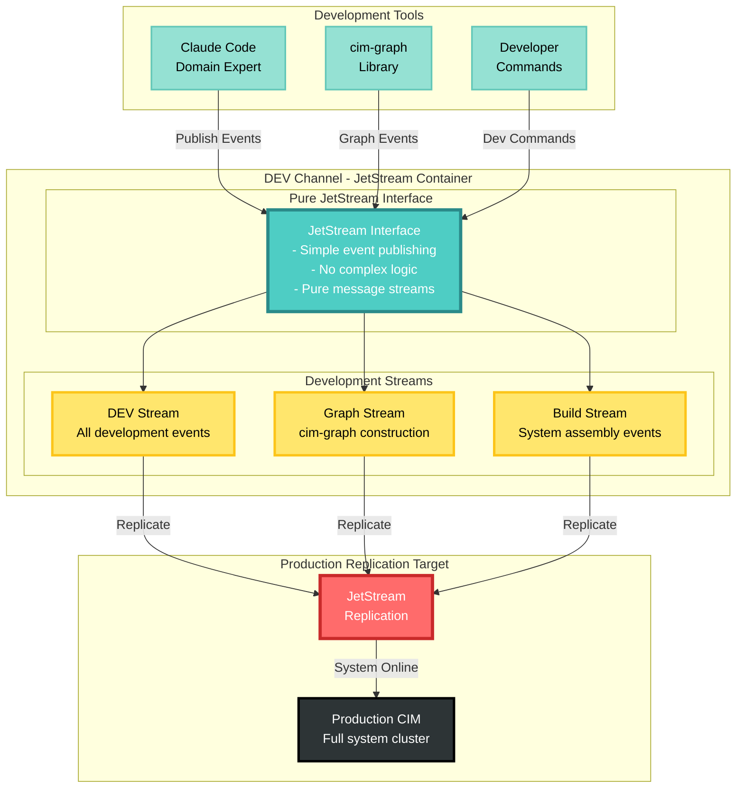

# CIM-Start: Agent-Powered CIM Development Template

Copyright 2025 - Cowboy AI, LLC

## 🎯 **This is a TEMPLATE Repository**

**CIM-Start is a GitHub template for creating CIM projects - it is NOT a CIM itself.**

When you use this template:
1. **Use as GitHub Template** → Creates your new CIM project repository  
2. **Your new repo** becomes the actual CIM you're building
3. **This template** provides the agent system to guide your CIM development

## 🤖 Meet SAGE - Your CIM Creation Guide Template

CIM-Start provides an intelligent agent system template orchestrated by **SAGE** - the template for guiding CIM creation. SAGE coordinates 17 specialized expert agent templates to help users build their actual CIMs.

**🎯 After initialization, users work with active SAGE:**
```bash
# SAGE is now active and domain-aware for the specific project:
@sage I want to build a CIM for my MyCIM domain
@sage Help my team understand our order processing domain  
@sage Set up complete CIM infrastructure for this project
```

**Active SAGE automatically:**
- **Knows the domain**: Based on git repository name and user initialization
- **Routes** requests to appropriate specialist agents for this specific CIM
- **Coordinates** workflows for actual CIM development
- **Synthesizes** guidance from all experts into unified direction  
- **Manages** the complete development journey for this domain

## 🚀 Template Purpose

CIM-Start provides a **template** for intelligent, agent-driven CIM development:

- **Expert-Guided Development Templates** - SAGE coordinates 17 specialized agent templates for CIM creation guidance
- **Collaborative Domain Discovery Templates** - Event Storming session templates with multiple domain expert guidance
- **Infrastructure Automation Templates** - NATS, network topology, and system configuration templates
- **Mathematical Foundation Templates** - Category Theory, Graph Theory, and IPLD integration patterns
- **Event-Driven Architecture Templates** - Complete event sourcing templates with real-time projection patterns

## 🎯 How to Create Your CIM Project

**Step 1: Clone CIM-Start as Your Project**
```bash
git clone https://github.com/TheCowboyAI/cim-start.git MyCIM
cd MyCIM
```

**Step 2: Initialize SAGE for Your Domain**
```bash
claude init
# SAGE detects repo name "MyCIM" and initializes domain
# SAGE removes template status and becomes active for your CIM
```

**Step 3: Ask SAGE to Guide Your CIM Development**
SAGE is now active and domain-aware:



### Development Workflow: DEV Channel to Production



### DEV Channel Architecture: Pure JetStream Interface



**Key Benefits of DEV Channel Architecture:**
- **Pure JetStream Interface**: Simple, lightweight development environment
- **Complete Development Capture**: Every build step recorded as events
- **Seamless Replication**: DEV channel events flow directly to production
- **No Development Overhead**: Just publish events, JetStream handles the rest
- **Event-Driven Construction**: Use cim-graph to build CIM through events
- **Live Production Ready**: Development events become production system memory

## 📁 Project Structure

```
cim-start/
├── .github/          # GitHub workflows and templates
├── agents/           # CIM agent configurations
│   ├── system/       # System agents (monitoring, ops)
│   ├── integration/  # Integration agents (APIs, sync)
│   ├── ai/          # AI agents (NLP, ML, decision making)  
│   ├── user/        # User agents (workflows, notifications)
│   ├── templates/   # Agent configuration templates
│   ├── examples/    # Complete agent integration examples
│   └── schemas/     # JSON schemas for agent validation
├── doc/             # Domain documentation and guides
│   ├── quick-start.md
│   ├── event-storming-guide.md
│   ├── nats-setup.md
│   └── agents-guide.md
├── domains/         # Your domain definitions
│   └── example-business/
└── docker-compose.yml  # NATS infrastructure
```

## 🚀 Getting Started

### Step 1: Create Your CIM Project from Template

**Use this repository as a GitHub template** (don't clone directly):

1. Click "Use this template" → "Create a new repository" on GitHub
2. Name your new repository (e.g., `my-ecommerce-cim`)
3. Clone your new repository:

```bash
git clone https://github.com/your-username/my-ecommerce-cim.git
cd my-ecommerce-cim
```

### Step 2: Initialize Claude Code

**Set up Claude Code with CIM-Start agents:**

```bash
# Initialize Claude Code in your project
claude init

# Verify agents are available
claude --help
# You should see @cim-expert and @domain-expert listed
```

### Step 3: Start Your Domain Creation

**Choose your path:**

**Option A - Complete Guided Setup:**
```bash
# 1. Launch NATS JetStream
make dev

# 2. Build network topology with cim-network MCP
claude "@network-expert Set up network topology for this domain"

# 3. Create your domain
claude "@domain-expert Help me create a customer service domain"
```

**Option B - Get Architecture Guidance:**
```bash
claude "@cim-expert Explain how the DEV channel works with JetStream"
```

**Option C - Just Launch NATS (minimal start):**
```bash
# Configure and launch JetStream container
make dev

# Start capturing events
make test-events
```

## 🏗️ Working with CIM-Start

### The SAGE Agent System

**🧙‍♂️ SAGE - Your Master CIM Orchestrator**
- Single entry point for all CIM development tasks
- Analyzes your needs and coordinates appropriate experts
- Manages multi-agent workflows for complex CIM creation
- Provides unified guidance synthesized from all specialists

**The Expert Team (SAGE coordinates these automatically):**

**🤖 @cim-expert** - CIM architecture and mathematical foundations
**🧩 @ddd-expert** - Domain boundaries and aggregate design
**🎯 @event-storming-expert** - Collaborative domain discovery
**❄️ @nix-expert** - Declarative system configuration
**⚡ @nats-expert** - NATS infrastructure and security
**🌐 @network-expert** - Network topology design
**🏗️ @domain-expert** - Final domain creation and validation

### SAGE-Orchestrated Workflow

**🎯 Primary Approach: Let SAGE Guide Everything**
```bash
# Single command that coordinates all experts automatically
/sage I want to build a CIM for my [business domain]

# Examples:
/sage I want to build a CIM for my e-commerce business
/sage Help my team understand our order processing domain  
/sage Set up complete CIM infrastructure for logistics
/sage Convert my existing microservices to CIM architecture
```

**🔧 Advanced: Direct Expert Access (when you know exactly what you need)**
```bash
# Domain discovery and analysis
/eventstorming order processing and fulfillment
/ddd analyze these event storming results

# Infrastructure configuration
/nats configure streams and security for my domain
/network set up topology with cim-network MCP  
/nix generate system configuration from events

# Final domain creation
/domain create complete cim-graph structure
```

**⚙️ Manual Setup (legacy approach, not recommended)**
- Manual infrastructure setup with make dev
- Manual agent coordination
- Manual workflow management

## 🐳 NATS JetStream Setup

### Docker Compose (Quickest)
```yaml
# docker-compose.yml provided
# Includes:
# - NATS server with JetStream
# - Monitoring dashboard
# - Persistent storage
```

### NixOS VM (Production-like)
```bash
# Build and run VM with NATS
nix build .#nats-vm
./result/bin/run-nats-vm
```

### Local Development
```bash
# Install NATS locally
nix develop
nats-server -js
```

## 📚 Documentation

- `CLAUDE.md` - **Claude Code development guide** with commands and patterns
- `/doc/domain-creation-mathematics.md` - Mathematical foundations (Category Theory, Graph Theory, IPLD)
- `/doc/object-store-user-guide.md` - Smart file system with CID patterns
- `/doc/structure-preserving-propagation.md` - How mathematical structures propagate
- `/agents/README.md` - Agent architecture overview

## 🤖 Claude Code Integration

CIM-Start is designed to work seamlessly with Claude Code:

### Why Use Claude Code with CIM-Start?

1. **Template-Based Setup**: Use this repo as a GitHub template, then run `claude init`
2. **Expert Agents**: Get specialized guidance from `@cim-expert` and `@domain-expert`
3. **Interactive Domain Creation**: Convert business requirements into mathematical CIM structures
4. **Architecture Guidance**: Understand Category Theory, Graph Theory, and IPLD foundations
5. **Schema-Compliant Output**: Generate cim-graph library compatible events automatically

### The Agents Available After `claude init`

**🤖 @cim-expert** - Architecture and mathematical foundations guidance
**🧩 @ddd-expert** - Domain boundary analysis and aggregate design
**🎯 @event-storming-expert** - Collaborative domain discovery facilitation
**❄️ @nix-expert** - Declarative system configuration from domain context
**⚡ @nats-expert** - NATS infrastructure configuration and security
**🌐 @network-expert** - Network topology design using cim-network MCP
**🏗️ @domain-expert** - Interactive domain creation with structured output

### Getting Started is Simple

```bash
# 1. Use as GitHub template (don't clone)
# 2. Clone your new repository
# 3. Initialize Claude Code
claude init

# 4. Start working immediately
claude "@domain-expert I need to create a billing domain for my SaaS"
```

No complex setup, no configuration files to edit - the agents guide you through everything.

## 🔧 Available Modules

CIM provides 38+ modules you can assemble:

### Core
- `cim-domain` - Domain definitions and event schemas
- `cim-projections` - Read models
- `cim-graph` - Knowledge graphs and workflow modeling (supersedes cim-domain-workflow)

### Domain
- `cim-domain-identity` - Users & auth
- `cim-domain-policy` - Business rules

### Infrastructure  
- `cim-network` - Network topology and infrastructure provisioning
- `cim-flashstor` - Object storage
- `cim-security` - Authorization

## 🎓 Learning Path

1. **Start Simple**: One aggregate, 3-5 events
2. **Add Complexity**: Multiple aggregates, policies
3. **Cross-Domain**: Integration with other domains
4. **Production**: Clustering, monitoring, deployment

## 📖 Example Domain

See `/domains/example-business/` for a complete e-commerce domain with:
- Customer registration
- Product catalog
- Order management
- Inventory tracking
- Fulfillment workflow

## 🚦 Quick Start Process

1. **Clone CIM-Start as your project:**
   ```bash
   git clone https://github.com/TheCowboyAI/cim-start.git MyCIM
   cd MyCIM
   ```

2. **Initialize SAGE for your domain:**
   ```bash
   claude init
   # SAGE detects "MyCIM" repo name and initializes as your domain
   # Template status removed - SAGE becomes active for your CIM
   ```

3. **Start building with SAGE:**
   ```bash
   # SAGE is now domain-aware and ready to orchestrate your CIM development
   @sage I want to build a CIM for my restaurant ordering system
   @sage Help me convert my existing API to event-driven CIM architecture  
   @sage My team needs to discover our complex business domain
   ```

4. **SAGE orchestrates everything:**
   - Domain discovery and boundary analysis
   - Infrastructure setup and configuration  
   - Development workflow and quality assurance
   - Complete CIM development journey

## 📝 License

MIT

## 🤝 Contributing

Contributions welcome! Please read our contributing guidelines.

## 💬 Support

- GitHub Issues: [Report bugs or request features]
- Documentation: [Full CIM documentation]
- Community: [Join our Discord]