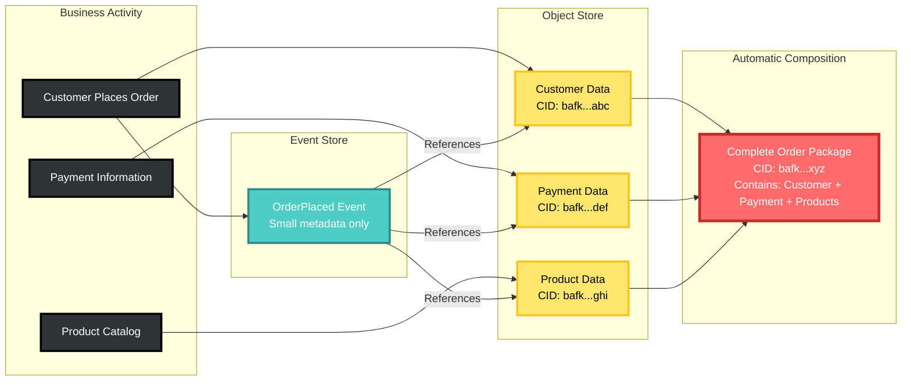
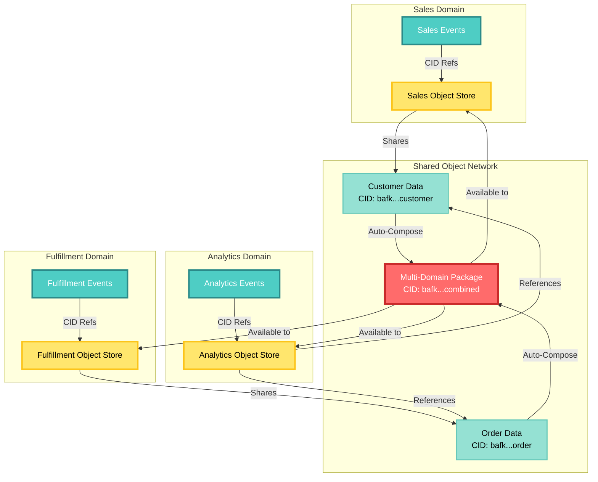

# CIM-Start: Domain-Driven Development Starter Kit

Copyright 2025 - Cowboy AI, LLC

## 🚀 Purpose

CIM-Start is your starting point for building a new domain-specific Composable Information Machine (CIM). It provides:

- **Production-ready NATS JetStream environment** for domain event storage
- **Comprehensive subject algebra** for organizing events, commands, and projections  
- **Domain discovery templates and guides** for event storming and modeling
- **Complete monitoring stack** with Prometheus and Grafana dashboards
- **Event-driven architecture patterns** with stream management tools
- **Domain-specific agent framework** for intelligent automation

## 🎯 Our Objective: Self-Composing Linked Stores

CIM-Start creates domains where all activity is stored in mathematically linked event and object stores that compose themselves automatically:

```mermaid
graph TB
    subgraph "Domain Boundary"
        subgraph "Event Store - Sequential Activities"
            Events[Domain Events]
            Systems[System Events]
            Commands[Commands]
        end
        
        subgraph "Object Store - Content Addressed"
            LargePayloads[Large Payloads]
            Documents[Documents]
            Files[Files]
        end
        
        subgraph "Self-Composing Links"
            Events -->|CID References| LargePayloads
            Systems -->|CID References| Documents
            Commands -->|CID References| Files
            
            LargePayloads -->|Auto-Combine| CompositeObjects[Composite Objects]
            Documents -->|Auto-Combine| CompositeObjects
            Files -->|Auto-Combine| CompositeObjects
        end
    end
    
    subgraph "Mathematical Foundations"
        CategoryTheory[Category Theory<br/>Domain = Category<br/>Objects = Entities<br/>Arrows = Systems]
        GraphTheory[Graph Theory<br/>Nodes = Entities<br/>Edges = Relationships<br/>Paths = Workflows]
        IPLD[Content Addressing<br/>CID = hash(content)<br/>Automatic Deduplication<br/>Referential Integrity]
    end
    
    Events --> CategoryTheory
    LargePayloads --> IPLD
    CompositeObjects --> GraphTheory
    
    style Events fill:#4ECDC4,stroke:#2B8A89,stroke-width:3px,color:#FFF
    style Systems fill:#4ECDC4,stroke:#2B8A89,stroke-width:3px,color:#FFF
    style Commands fill:#4ECDC4,stroke:#2B8A89,stroke-width:3px,color:#FFF
    style LargePayloads fill:#FFE66D,stroke:#FCC419,stroke-width:3px,color:#000
    style Documents fill:#FFE66D,stroke:#FCC419,stroke-width:3px,color:#000
    style Files fill:#FFE66D,stroke:#FCC419,stroke-width:3px,color:#000
    style CompositeObjects fill:#FF6B6B,stroke:#C92A2A,stroke-width:4px,color:#FFF
    style CategoryTheory fill:#2D3436,stroke:#000,stroke-width:3px,color:#FFF
    style GraphTheory fill:#2D3436,stroke:#000,stroke-width:3px,color:#FFF
    style IPLD fill:#2D3436,stroke:#000,stroke-width:3px,color:#FFF
```

### How Self-Composition Works



### Cross-Domain Composition and Distribution



**Key Benefits:**
- **No Data Duplication**: Same customer data referenced across all domains
- **Automatic Composition**: Related data combines into logical packages  
- **Mathematical Consistency**: Category Theory ensures valid relationships
- **Content Integrity**: IPLD guarantees data hasn't been corrupted
- **Efficient Distribution**: Only unique content is stored and shared

## 📁 Project Structure

```
cim-start/
├── .github/          # GitHub workflows and templates
├── agents/           # CIM agent configurations
│   ├── system/       # System agents (monitoring, ops)
│   ├── integration/  # Integration agents (APIs, sync)
│   ├── ai/          # AI agents (NLP, ML, decision making)  
│   ├── user/        # User agents (workflows, notifications)
│   ├── templates/   # Agent configuration templates
│   ├── examples/    # Complete agent integration examples
│   └── schemas/     # JSON schemas for agent validation
├── doc/             # Domain documentation and guides
│   ├── quick-start.md
│   ├── event-storming-guide.md
│   ├── nats-setup.md
│   └── agents-guide.md
├── domains/         # Your domain definitions
│   └── example-business/
└── docker-compose.yml  # NATS infrastructure
```

## 🚀 Getting Started

### Step 1: Create Your CIM Project from Template

**Use this repository as a GitHub template** (don't clone directly):

1. Click "Use this template" → "Create a new repository" on GitHub
2. Name your new repository (e.g., `my-ecommerce-cim`)
3. Clone your new repository:

```bash
git clone https://github.com/your-username/my-ecommerce-cim.git
cd my-ecommerce-cim
```

### Step 2: Initialize Claude Code

**Set up Claude Code with CIM-Start agents:**

```bash
# Initialize Claude Code in your project
claude init

# Verify agents are available
claude --help
# You should see @cim-expert and @domain-expert listed
```

### Step 3: Start Your Domain Creation

**Choose your path:**

**Option A - Get CIM Architecture Guidance:**
```bash
claude "@cim-expert Explain how the Object Store works with NATS"
```

**Option B - Create Your First Domain:**
```bash
claude "@domain-expert Help me create a customer service domain"
```

**Option C - Traditional Setup (if you prefer manual approach):**
```bash
# Start NATS infrastructure
make dev

# Test the system
make test-events
```

## 🏗️ Working with CIM-Start

### The Claude Code Workflow

Once you've initialized Claude Code, you have access to two specialized agents:

**🤖 @cim-expert - Your CIM Architecture Guide**
- Explains mathematical foundations (Category Theory, Graph Theory, IPLD)
- Guides Object Store usage and CID patterns
- Troubleshoots NATS patterns and subject algebra
- Provides structure-preserving propagation guidance

**🏗️ @domain-expert - Your Domain Creation Specialist**  
- Interactive domain discovery sessions
- Converts business requirements into mathematically sound CIM domains
- Generates complete `domain.cim-graph.yaml` files
- Creates cim-graph library compatible events

### Recommended Workflow

1. **Start with Architecture Understanding:**
   ```bash
   claude "@cim-expert What are the benefits of content-addressed storage?"
   ```

2. **Create Your Domain:**
   ```bash
   claude "@domain-expert I need to build an e-commerce domain"
   ```

3. **Get Implementation Guidance:**
   ```bash
   claude "@cim-expert How do I set up NATS streams for my domain?"
   ```

4. **Iterate and Refine:**
   Continue the conversation with either agent as you develop your domain.

## 🐳 NATS JetStream Setup

### Docker Compose (Quickest)
```yaml
# docker-compose.yml provided
# Includes:
# - NATS server with JetStream
# - Monitoring dashboard
# - Persistent storage
```

### NixOS VM (Production-like)
```bash
# Build and run VM with NATS
nix build .#nats-vm
./result/bin/run-nats-vm
```

### Local Development
```bash
# Install NATS locally
nix develop
nats-server -js
```

## 📚 Documentation

- `CLAUDE.md` - **Claude Code development guide** with commands and patterns
- `/doc/domain-creation-mathematics.md` - Mathematical foundations (Category Theory, Graph Theory, IPLD)
- `/doc/object-store-user-guide.md` - Smart file system with CID patterns
- `/doc/structure-preserving-propagation.md` - How mathematical structures propagate
- `/agents/README.md` - Agent architecture overview

## 🤖 Claude Code Integration

CIM-Start is designed to work seamlessly with Claude Code:

### Why Use Claude Code with CIM-Start?

1. **Template-Based Setup**: Use this repo as a GitHub template, then run `claude init`
2. **Expert Agents**: Get specialized guidance from `@cim-expert` and `@domain-expert`
3. **Interactive Domain Creation**: Convert business requirements into mathematical CIM structures
4. **Architecture Guidance**: Understand Category Theory, Graph Theory, and IPLD foundations
5. **Schema-Compliant Output**: Generate cim-graph library compatible events automatically

### The Agents Available After `claude init`

**🤖 @cim-expert** - Architecture and mathematical foundations guidance
**🏗️ @domain-expert** - Interactive domain creation with structured output

### Getting Started is Simple

```bash
# 1. Use as GitHub template (don't clone)
# 2. Clone your new repository
# 3. Initialize Claude Code
claude init

# 4. Start working immediately
claude "@domain-expert I need to create a billing domain for my SaaS"
```

No complex setup, no configuration files to edit - the agents guide you through everything.

## 🔧 Available Modules

CIM provides 38+ modules you can assemble:

### Core
- `cim-domain` - Domain definitions and event schemas
- `cim-projections` - Read models
- `cim-graph` - Knowledge graphs

### Domain
- `cim-domain-identity` - Users & auth
- `cim-domain-workflow` - Business processes
- `cim-domain-policy` - Business rules

### Infrastructure  
- `cim-network` - Network topology
- `cim-flashstor` - Object storage
- `cim-security` - Authorization

## 🎓 Learning Path

1. **Start Simple**: One aggregate, 3-5 events
2. **Add Complexity**: Multiple aggregates, policies
3. **Cross-Domain**: Integration with other domains
4. **Production**: Clustering, monitoring, deployment

## 📖 Example Domain

See `/domains/example-business/` for a complete e-commerce domain with:
- Customer registration
- Product catalog
- Order management
- Inventory tracking
- Fulfillment workflow

## 🚦 Next Steps

1. **Use this repo as a GitHub template** (don't clone directly)
2. **Run `claude init`** in your new project directory
3. **Start with `@domain-expert`** to create your first domain
4. **Use `@cim-expert`** for architecture questions
5. **Follow the agents' guidance** for NATS setup and implementation
6. **Iterate** with the agents as you build your CIM

## 📝 License

MIT

## 🤝 Contributing

Contributions welcome! Please read our contributing guidelines.

## 💬 Support

- GitHub Issues: [Report bugs or request features]
- Documentation: [Full CIM documentation]
- Community: [Join our Discord]